# AgentSphere Architecture Plan

## Executive Summary

AgentSphere is an enterprise-grade multi-tenant conversational AI platform that provides AI-powered customer support through multiple communication channels. The platform is designed with clean architecture principles, separating concerns into distinct layers that communicate through well-defined contracts.

**Architecture Version**: 1.1 (Frozen — v1.1 · Documentation: v0.2 finalized)

---

## 1. C4 Context Diagram

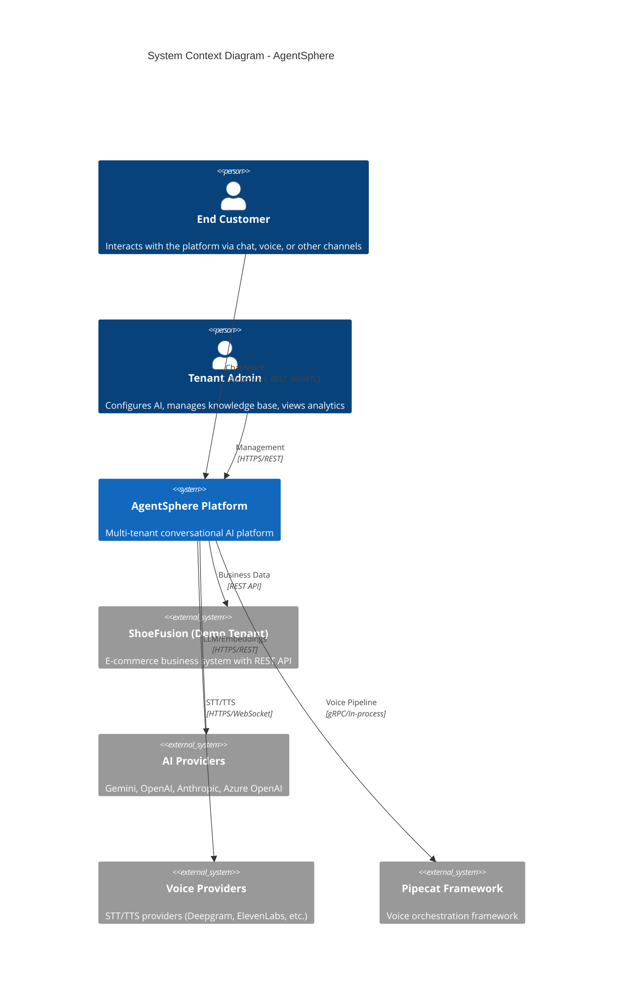

### Context Description

| Actor/System | Role | Interaction |
|-------------|------|-------------|
| **End Customer** | Uses the platform via web chat, voice calls, or future channels | Sends messages, receives AI responses |
| **Tenant Admin** | Configures and manages their tenant | Manages knowledge base, AI settings, views analytics |
| **AgentSphere Platform** | Core multi-tenant AI platform | Orchestrates all conversations, manages tenants, executes AI workflows |
| **ShoeFusion** | Demo tenant business system | Provides product, order, customer data via REST API |
| **AI Providers** | LLM and embedding services | Provide completions, embeddings, reranking |
| **Voice Providers** | Speech-to-Text and Text-to-Speech | Convert audio ↔ text for voice conversations |
| **Pipecat** | Voice orchestration framework | Manages voice pipeline (STT → AI Core → TTS) |

---

## 2. C4 Container Diagram

```mermaid
C4Container
title Container Diagram - AgentSphere Platform

Container_Boundary(platform, "AgentSphere Platform") {
    Container(web_api, "Web API Gateway", "FastAPI", "REST API, WebSocket, Auth, Rate Limiting, Multi-tenant routing")
    Container(chat_transport, "Chat Transport", "FastAPI/WebSocket", "Web Chat, WebSocket connections, Session management")
    Container(voice_transport, "Voice Transport", "Pipecat/Python", "Voice call handling, WebRTC, Media streaming")
    Container(ai_core, "Shared AI Core", "Python/LangGraph", "Intent classification, Planning, Tool execution, Memory, RAG, Response generation")
    Container(ai_gateway, "AI Gateway", "Python", "Model routing, Provider routing, Failover, Retry orchestration, Cost/latency optimisation, Fallback strategy")
    Container(prompt_manager, "Prompt Manager", "Python", "System/tenant prompts, Templates, Versioning, Variables, Rendering, Caching")
    Container(ai_inference, "AI Inference Service", "Python", "Prompt execution, Structured output parsing, Retries, Token accounting, Guardrails, Cost tracking")
    Container(event_bus, "Event Bus", "Python/Protocol", "Domain event publishing via EventBus(Protocol), Async handlers for Analytics, Audit, Notifications, Workers")
    Container(integration_layer, "Business Integration Layer", "Python/Adapters", "Tenant-specific business system adapters (ShoeFusion, Shopify, etc.)")
    Container(rag_engine, "RAG Engine", "Python", "Document ingestion, Embedding generation, Vector search, Reranking, Context building")
    Container(feature_flags, "Feature Flag Service", "Python/PostgreSQL", "Tenant-scoped feature flags for Voice, RAG, Billing, Analytics, Knowledge Base, Evaluation")
    Container(escalation_svc, "Escalation Service", "Python", "Human escalation via Slack, Email, Zendesk, Freshdesk, Webhook, CRM integrations")
    Container(evaluation_svc, "AI Evaluation Service", "Python", "Metrics: Latency, Tokens, Cost, Hallucination, Confidence, Groundedness, Safety, Quality")
    Container(session_recorder, "AI Session Recorder", "Python", "Full session capture: prompts, RAG chunks, tool calls, outputs, latency, errors, replay timeline")
    Container(tenant_service, "Tenant Management Service", "FastAPI", "Tenant CRUD, Configuration, API keys, Billing (future)")
    Container(auth_service, "Auth Service", "FastAPI", "JWT, RBAC, API Keys, Tenant isolation")
}

ContainerDb(postgres, "PostgreSQL", "Primary Database", "Tenants, Users, Conversations, Messages, Tools, Configurations")
ContainerDb(vector_db, "Vector Database (pgvector)", "Embeddings Storage", "Document chunks, Embeddings, Tenant-scoped")
ContainerDb(redis, "Redis", "Caching & Sessions", "Conversation cache, Embedding cache, Rate limiting, Sessions (future)")

Container_Ext(shoefusion_api, "ShoeFusion REST API", "External Business System", "Products, Orders, Customers, Inventory")
Container_Ext(ai_apis, "AI Provider APIs", "LLM/Embedding Providers", "Gemini, OpenAI, Anthropic, Azure")
Container_Ext(voice_apis, "Voice Provider APIs", "STT/TTS Providers", "Deepgram, ElevenLabs, Cartesia, etc.")
Container_Ext(pipecat_framework, "Pipecat", "Voice Orchestration", "Pipeline management, Audio I/O")

Rel(web_api, chat_transport, "Routes chat requests", "Internal HTTP/gRPC")
Rel(web_api, voice_transport, "Routes voice requests", "Internal HTTP/gRPC")
Rel(chat_transport, ai_core, "Processes messages", "Internal gRPC")
Rel(voice_transport, ai_core, "Processes voice turns", "Internal gRPC")
Rel(voice_transport, pipecat_framework, "Orchestrates pipeline", "In-process/gRPC")
Rel(ai_core, ai_gateway, "Routes AI requests", "Internal gRPC")
Rel(ai_gateway, prompt_manager, "Gets rendered prompts", "Internal gRPC")
Rel(ai_gateway, ai_inference, "Executes LLM calls via selected provider", "Internal gRPC")
Rel(prompt_manager, ai_inference, "Supplies rendered prompt", "Internal gRPC")
Rel(ai_core, integration_layer, "Calls business tools", "Internal gRPC")
Rel(ai_core, rag_engine, "Retrieves context", "Internal gRPC")
Rel(ai_core, event_bus, "Publishes domain events", "Internal gRPC")
Rel(ai_core, session_recorder, "Records full session", "Internal gRPC")
Rel(ai_core, evaluation_svc, "Triggers evaluation", "Internal gRPC")
Rel(ai_core, escalation_svc, "Publishes escalation events", "Internal gRPC")
Rel(ai_core, feature_flags, "Checks feature availability", "Internal gRPC")
Rel(integration_layer, shoefusion_api, "Fetches business data", "HTTPS/REST")
Rel(ai_inference, ai_apis, "LLM/Embeddings", "HTTPS/REST")
Rel(voice_transport, voice_apis, "STT/TTS", "HTTPS/WebSocket")
Rel(rag_engine, vector_db, "Stores/Queries vectors", "PostgreSQL/pgvector")
Rel(tenant_service, postgres, "Manages tenants", "SQL")
Rel(auth_service, postgres, "Manages auth", "SQL")
Rel(web_api, redis, "Caching/Sessions", "Redis Protocol")
Rel(event_bus, redis, "Event streaming via EventBus(Protocol)", "Redis Streams / Kafka / RabbitMQ")
```

### Container Descriptions

| Container | Technology | Responsibility |
|-----------|------------|----------------|
| **Web API Gateway** | FastAPI | Entry point, auth, rate limiting, tenant routing, REST/WebSocket |
| **Chat Transport** | FastAPI + WebSocket | Web chat sessions, real-time messaging, typing indicators |
| **Voice Transport** | Pipecat + Python | Voice call lifecycle, WebRTC, media handling |
| **Shared AI Core** | Python + LangGraph | Core AI workflow: intent → plan → tools → memory → RAG → response |
| **AI Gateway** | Python | Model routing, provider failover, retry orchestration, cost/latency optimisation, fallback strategy |
| **Prompt Manager** | Python | System/tenant prompts, templates, versioning, variables, rendering, caching |
| **AI Inference Service** | Python | Prompt execution, structured output parsing, retries, token accounting, guardrails, cost tracking |
| **Event Bus** | Python + Protocol | Domain event publishing via `EventBus(Protocol)`, impl: Redis Streams (Phase 1), Kafka/RabbitMQ/NATS (future) |
| **Business Integration Layer** | Python Adapters | Tenant-specific adapters (ShoeFusion, Shopify, etc.) |
| **RAG Engine** | Python | Document processing, embeddings, vector search, reranking, context building |
| **Feature Flag Service** | Python + PostgreSQL | Tenant-scoped feature flags for Voice, RAG, Billing, Analytics, Knowledge Base, Evaluation |
| **Escalation Service** | Python | Human escalation via Slack, Email, Zendesk, Freshdesk, Webhook, CRM integrations |
| **AI Evaluation Service** | Python | Metrics: latency, tokens, cost, hallucination, confidence, groundedness, safety, quality |
| **AI Session Recorder** | Python | Full session capture: prompts, RAG chunks, tool calls, outputs, latency, errors, replay timeline |
| **Tenant Management** | FastAPI | Tenant CRUD, configuration, API keys, feature flags |
| **Auth Service** | FastAPI | JWT, RBAC, API keys, tenant isolation enforcement |
| **PostgreSQL** | PostgreSQL + pgvector | Primary data: tenants, users, conversations, messages, configs |
| **Vector Database** | pgvector (in PostgreSQL) | Tenant-scoped document embeddings and similarity search |
| **Redis** | Redis | Caching, sessions, rate limiting, event streaming (via EventBus impl), background job queue (future) |

---

## 3. Sequence Diagrams

### 3.1 Web Chat Message Flow

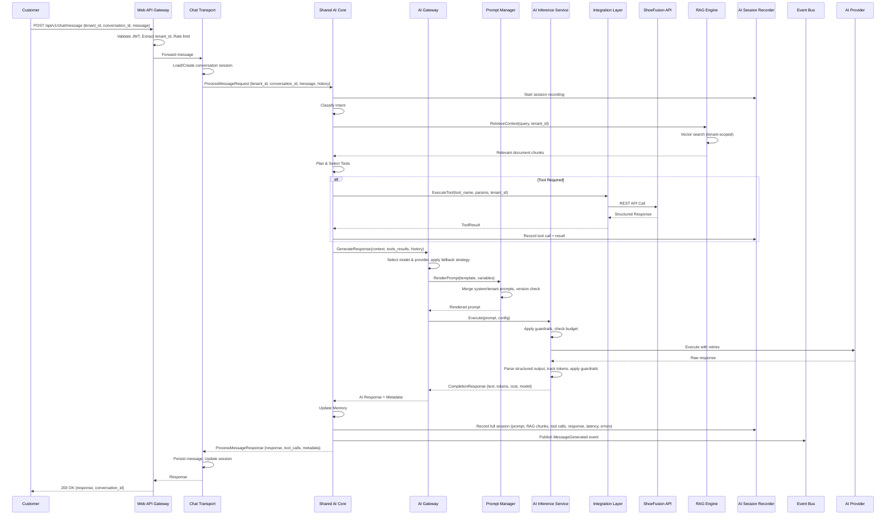

### 3.2 Voice Call Flow (Pipecat Integration)

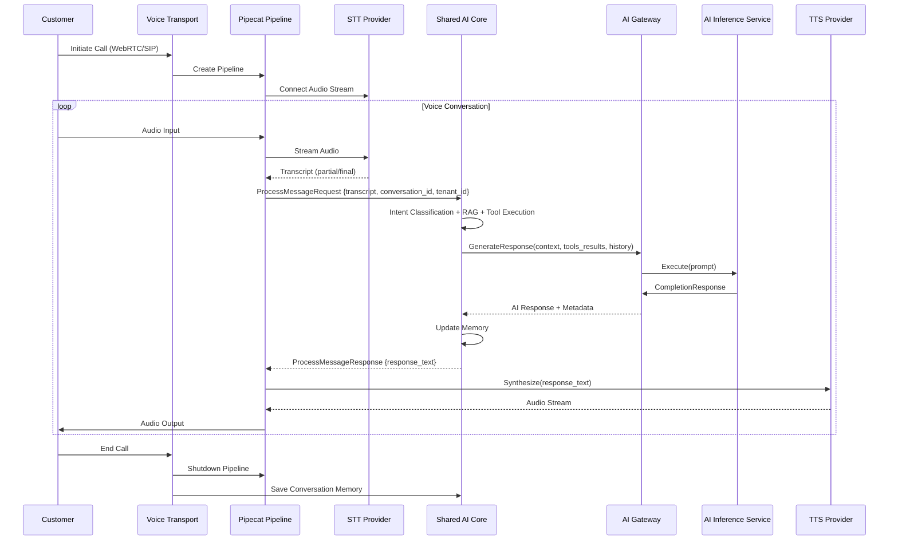

### 3.3 Document Ingestion Flow (RAG)

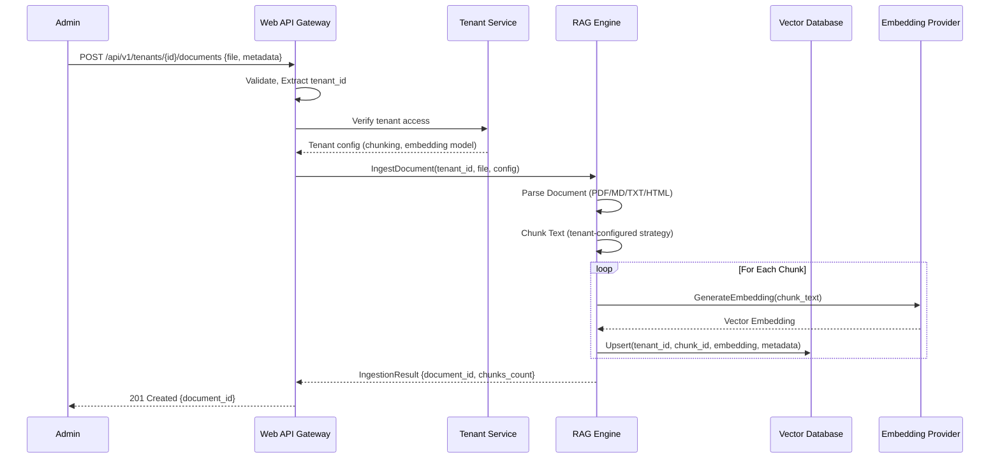

### 3.5 Event Bus Flow (Domain Events)

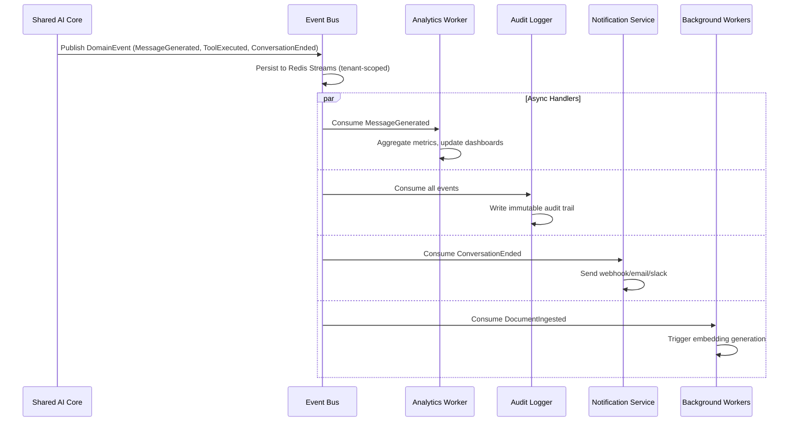

### 3.4 Tool Execution Flow

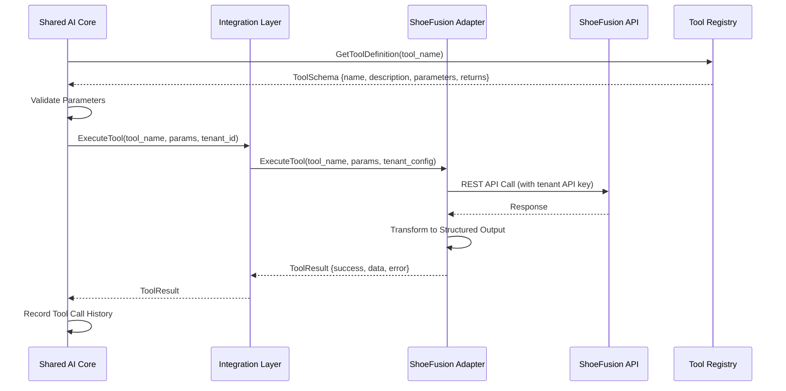

---

## 4. ER Diagram

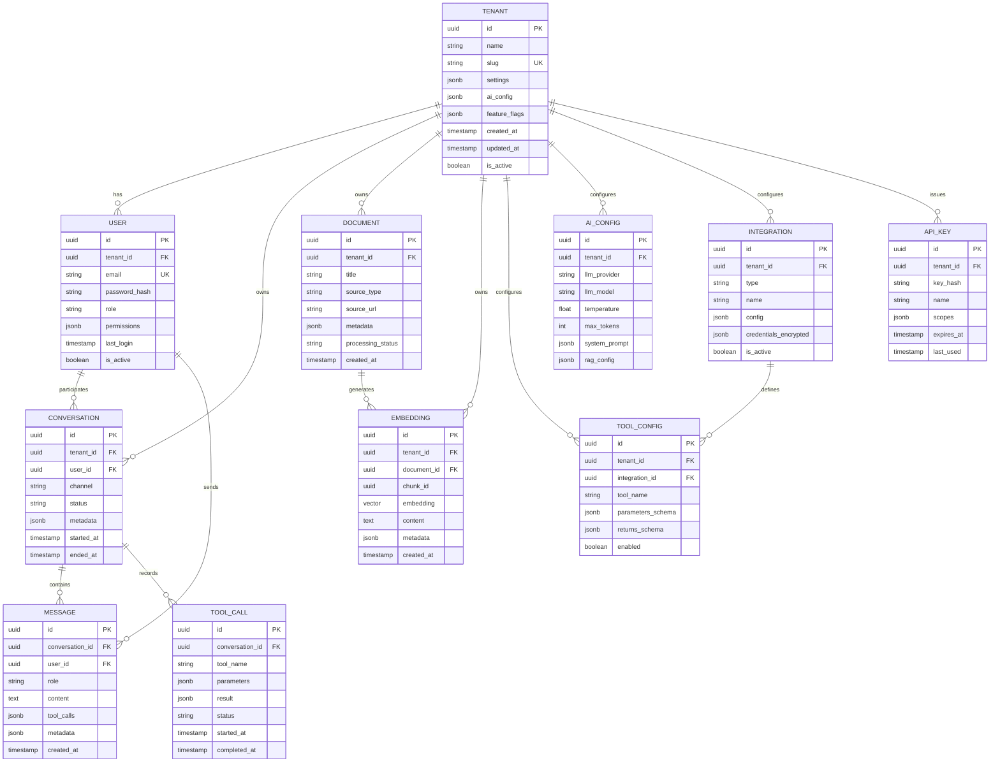

### Table Descriptions

| Table | Purpose | Key Design Decisions |
|-------|---------|---------------------|
| **tenant** | Root entity for multi-tenancy | All other tables reference tenant_id for isolation |
| **user** | Tenant users (admins, agents) | Scoped to tenant, supports RBAC |
| **conversation** | Chat/voice sessions | Channel-agnostic, stores metadata for analytics |
| **message** | Individual messages | Stores role, content, tool calls for full history |
| **tool_call** | Tool execution audit trail | Separate from messages for querying/analytics |
| **document** | Knowledge base documents | Tracks processing status for async ingestion |
| **embedding** | Vector embeddings | Uses pgvector, tenant-scoped, stores chunk content for retrieval |
| **tool_config** | Per-tenant tool configuration | Enables/disables tools per tenant |
| **ai_config** | Per-tenant AI settings | Model, temperature, system prompt, RAG config |
| **integration** | Business system connections | Encrypted credentials, type-based adapter routing |
| **api_key** | Programmatic access | Scoped permissions, expiration, usage tracking |

---

## 5. Folder Structure

```
agentsphere/
├── .github/
│   ├── workflows/              # CI/CD pipelines
│   └── dependabot.yml
├── .vscode/
│   └── settings.json
├── docs/
│   ├── architecture/
│   │   ├── c4-context.md
│   │   ├── c4-container.md
│   │   ├── sequence-diagrams.md
│   │   ├── er-diagram.md
│   │   └── adr/
│   │       ├── 001-use-fastapi.md
│   │       ├── 002-use-langgraph.md
│   │       ├── 003-use-pgvector.md
│   │       ├── 004-pipecat-voice-only.md
│   │       └── 005-provider-abstractions.md
│   ├── api/
│   │   ├── openapi.yaml
│   │   └── webhooks.md
│   ├── development/
│   │   ├── setup.md
│   │   ├── testing.md
│   │   └── contributing.md
│   └── deployment/
│       ├── docker.md
│       ├── kubernetes.md
│       └── environment-variables.md
├── scripts/
│   ├── dev.sh
│   ├── test.sh
│   ├── lint.sh
│   ├── migrate.sh
│   └── seed.sh
├── docker/
│   ├── Dockerfile.api
│   ├── Dockerfile.worker
│   ├── Dockerfile.voice
│   ├── docker-compose.yml
│   └── docker-compose.prod.yml
├── kubernetes/
│   ├── base/
│   ├── overlays/
│   │   ├── dev/
│   │   ├── staging/
│   │   └── prod/
│   └── helm/
├── frontend/
│   ├── app/
│   │   ├── layout.tsx
│   │   ├── page.tsx
│   │   └── globals.css
│   ├── components/
│   │   ├── ui/
│   │   ├── layout/
│   │   └── common/
│   ├── features/
│   │   ├── chat/
│   │   ├── voice/
│   │   ├── knowledge/
│   │   ├── admin/
│   │   └── analytics/
│   ├── hooks/
│   ├── providers/
│   ├── contexts/
│   ├── services/
│   ├── lib/
│   ├── types/
│   └── styles/
├── src/
│   ├── agentsphere/
│   │   ├── __init__.py
│   │   ├── __main__.py
│   │   ├── config/
│   │   │   ├── __init__.py
│   │   │   ├── settings.py
│   │   │   ├── database.py
│   │   │   ├── redis.py
│   │   │   └── logging.py
│   │   ├── domain/
│   │   │   ├── __init__.py
│   │   │   ├── models/
│   │   │   │   ├── __init__.py
│   │   │   │   ├── tenant.py
│   │   │   │   ├── user.py
│   │   │   │   ├── conversation.py
│   │   │   │   ├── message.py
│   │   │   │   ├── document.py
│   │   │   │   ├── embedding.py
│   │   │   │   ├── tool.py
│   │   │   │   ├── integration.py
│   │   │   │   └── api_key.py
│   │   │   ├── entities/
│   │   │   │   ├── __init__.py
│   │   │   │   ├── tenant.py
│   │   │   │   ├── conversation.py
│   │   │   │   └── document.py
│   │   │   ├── value_objects/
│   │   │   │   ├── __init__.py
│   │   │   │   ├── conversation_id.py
│   │   │   │   ├── tenant_id.py
│   │   │   │   └── message_id.py
│   │   │   └── events/
│   │   │       ├── __init__.py
│   │   │       ├── conversation_started.py
│   │   │       ├── message_received.py
│   │   │       └── tool_executed.py
│   │   ├── application/
│   │   │   ├── __init__.py
│   │   │   ├── ports/
│   │   │   │   ├── __init__.py
│   │   │   │   ├── llm_provider.py
│   │   │   │   ├── embedding_provider.py
│   │   │   │   ├── reranker_provider.py
│   │   │   │   ├── stt_provider.py
│   │   │   │   ├── tts_provider.py
│   │   │   │   ├── vector_store.py
│   │   │   │   ├── cache.py
│   │   │   │   ├── business_adapter.py
│   │   │   │   └── auth_provider.py
│   │   │   ├── use_cases/
│   │   │   │   ├── __init__.py
│   │   │   │   ├── chat/
│   │   │   │   │   ├── __init__.py
│   │   │   │   │   ├── send_message.py
│   │   │   │   │   ├── get_conversation.py
│   │   │   │   │   └── list_conversations.py
│   │   │   │   ├── voice/
│   │   │   │   │   ├── __init__.py
│   │   │   │   │   ├── start_call.py
│   │   │   │   │   └── end_call.py
│   │   │   │   ├── rag/
│   │   │   │   │   ├── __init__.py
│   │   │   │   │   ├── ingest_document.py
│   │   │   │   │   ├── search_documents.py
│   │   │   │   │   └── delete_document.py
│   │   │   │   ├── tenant/
│   │   │   │   │   ├── __init__.py
│   │   │   │   │   ├── create_tenant.py
│   │   │   │   │   ├── update_tenant.py
│   │   │   │   │   └── get_tenant.py
│   │   │   │   └── auth/
│   │   │   │       ├── __init__.py
│   │   │   │       ├── login.py
│   │   │   │       ├── register.py
│   │   │   │       └── refresh_token.py
│   │   │   └── services/
│   │   │       ├── __init__.py
│   │   │       ├── conversation_service.py
│   │   │       ├── message_service.py
│   │   │       └── memory_service.py
│   │   ├── infrastructure/
│   │   │   ├── __init__.py
│   │   │   ├── persistence/
│   │   │   │   ├── __init__.py
│   │   │   │   ├── repositories/
│   │   │   │   │   ├── __init__.py
│   │   │   │   │   ├── tenant_repository.py
│   │   │   │   │   ├── conversation_repository.py
│   │   │   │   │   ├── message_repository.py
│   │   │   │   │   ├── document_repository.py
│   │   │   │   │   ├── embedding_repository.py
│   │   │   │   │   ├── tool_repository.py
│   │   │   │   │   └── integration_repository.py
│   │   │   │   ├── orm/
│   │   │   │   │   ├── __init__.py
│   │   │   │   │   ├── models.py
│   │   │   │   │   └── mappers.py
│   │   │   │   └── migrations/
│   │   │   │       └── alembic/
│   │   │   ├── ai/
│   │   │   │   ├── __init__.py
│   │   │   │   ├── providers/
│   │   │   │   │   ├── __init__.py
│   │   │   │   │   ├── gemini/
│   │   │   │   │   │   ├── __init__.py
│   │   │   │   │   │   ├── llm.py
│   │   │   │   │   │   ├── embedding.py
│   │   │   │   │   │   └── reranker.py
│   │   │   │   │   ├── openai/
│   │   │   │   │   ├── anthropic/
│   │   │   │   │   └── azure_openai/
│   │   │   │   ├── voice/
│   │   │   │   │   ├── __init__.py
│   │   │   │   │   ├── deepgram/
│   │   │   │   │   │   ├── __init__.py
│   │   │   │   │   │   └── stt.py
│   │   │   │   │   ├── elevenlabs/
│   │   │   │   │   │   ├── __init__.py
│   │   │   │   │   │   └── tts.py
│   │   │   │   │   └── cartesia/
│   │   │   │   ├── core/
│   │   │   │   │   ├── __init__.py
│   │   │   │   │   ├── intent_classifier.py
│   │   │   │   │   ├── planner.py
│   │   │   │   │   ├── tool_selector.py
│   │   │   │   │   ├── tool_executor.py
│   │   │   │   │   ├── memory_manager.py
│   │   │   │   │   ├── rag_retriever.py
│   │   │   │   │   ├── response_generator.py
│   │   │   │   │   └── escalation_handler.py
│   │   │   │   ├── graph/
│   │   │   │   │   ├── __init__.py
│   │   │   │   │   ├── nodes/
│   │   │   │   │   │   ├── __init__.py
│   │   │   │   │   │   ├── classify_intent.py
│   │   │   │   │   │   ├── retrieve_context.py
│   │   │   │   │   │   ├── plan_actions.py
│   │   │   │   │   │   ├── execute_tools.py
│   │   │   │   │   │   ├── generate_response.py
│   │   │   │   │   │   └── update_memory.py
│   │   │   │   │   ├── edges/
│   │   │   │   │   │   ├── __init__.py
│   │   │   │   │   │   └── routing.py
│   │   │   │   │   └── state.py
│   │   │   │   └── langgraph_workflow.py
│   │   │   ├── ai_gateway/
│   │   │   │   ├── __init__.py
│   │   │   │   ├── router.py
│   │   │   │   ├── model_selector.py
│   │   │   │   ├── provider_failover.py
│   │   │   │   ├── cost_optimiser.py
│   │   │   │   └── latency_optimiser.py
│   │   │   ├── prompt_manager/
│   │   │   │   ├── __init__.py
│   │   │   │   ├── manager.py
│   │   │   │   ├── templates.py
│   │   │   │   ├── versioning.py
│   │   │   │   ├── renderer.py
│   │   │   │   └── cache.py
│   │   │   ├── integrations/
│   │   │   │   ├── __init__.py
│   │   │   │   ├── base.py
│   │   │   │   ├── registry.py
│   │   │   │   ├── shoefusion/
│   │   │   │   │   ├── __init__.py
│   │   │   │   │   ├── adapter.py
│   │   │   │   │   ├── client.py
│   │   │   │   │   ├── tools/
│   │   │   │   │   │   ├── __init__.py
│   │   │   │   │   │   ├── get_product.py
│   │   │   │   │   │   ├── get_order.py
│   │   │   │   │   │   ├── check_inventory.py
│   │   │   │   │   │   └── create_ticket.py
│   │   │   │   │   └── mappings.py
│   │   │   │   ├── shopify/
│   │   │   │   ├── woocommerce/
│   │   │   │   └── custom/
│   │   │   ├── event_bus/
│   │   │   │   ├── __init__.py
│   │   │   │   ├── redis_event_bus.py
│   │   │   │   ├── kafka_event_bus.py      (future)
│   │   │   │   ├── rabbitmq_event_bus.py   (future)
│   │   │   │   └── nats_event_bus.py       (future)
│   │   │   ├── vector_store/
│   │   │   │   ├── __init__.py
│   │   │   │   ├── pgvector_store.py
│   │   │   │   └── redis_cache.py
│   │   │   ├── cache/
│   │   │   │   ├── __init__.py
│   │   │   │   └── redis_cache.py
│   │   │   ├── feature_flags/
│   │   │   │   ├── __init__.py
│   │   │   │   ├── service.py
│   │   │   │   └── middleware.py
│   │   │   ├── auth/
│   │   │   │   ├── __init__.py
│   │   │   │   ├── jwt_handler.py
│   │   │   │   ├── rbac.py
│   │   │   │   └── api_key_validator.py
│   │   │   ├── escalation/
│   │   │   │   ├── __init__.py
│   │   │   │   ├── service.py
│   │   │   │   ├── handlers/
│   │   │   │   │   ├── __init__.py
│   │   │   │   │   ├── slack_handler.py
│   │   │   │   │   ├── email_handler.py
│   │   │   │   │   ├── zendesk_handler.py
│   │   │   │   │   ├── freshdesk_handler.py
│   │   │   │   │   └── webhook_handler.py
│   │   │   │   └── config.py
│   │   │   ├── evaluation/
│   │   │   │   ├── __init__.py
│   │   │   │   ├── service.py
│   │   │   │   ├── evaluators/
│   │   │   │   │   ├── __init__.py
│   │   │   │   │   ├── latency.py
│   │   │   │   │   ├── token_usage.py
│   │   │   │   │   ├── cost.py
│   │   │   │   │   ├── hallucination.py
│   │   │   │   │   ├── groundedness.py
│   │   │   │   │   ├── safety.py
│   │   │   │   │   └── confidence.py
│   │   │   │   └── store.py
│   │   │   └── observability/
│   │   │       ├── __init__.py
│   │   │       ├── logging.py
│   │   │       ├── tracing.py
│   │   │       ├── metrics.py
│   │   │       ├── langsmith.py
│   │   │       └── session_recorder.py
│   │   ├── interfaces/
│   │   │   ├── __init__.py
│   │   │   ├── api/
│   │   │   │   ├── __init__.py
│   │   │   │   ├── routes/
│   │   │   │   │   ├── __init__.py
│   │   │   │   │   ├── health.py
│   │   │   │   │   ├── auth.py
│   │   │   │   │   ├── tenants.py
│   │   │   │   │   ├── conversations.py
│   │   │   │   │   ├── messages.py
│   │   │   │   │   ├── documents.py
│   │   │   │   │   ├── tools.py
│   │   │   │   │   ├── integrations.py
│   │   │   │   │   └── analytics.py
│   │   │   │   ├── middleware/
│   │   │   │   │   ├── __init__.py
│   │   │   │   │   ├── auth.py
│   │   │   │   │   ├── tenant.py
│   │   │   │   │   ├── rate_limit.py
│   │   │   │   │   └── logging.py
│   │   │   │   ├── dependencies.py
│   │   │   │   └── exceptions.py
│   │   │   ├── websocket/
│   │   │   │   ├── __init__.py
│   │   │   │   ├── chat_handler.py
│   │   │   │   ├── connection_manager.py
│   │   │   │   └── events.py
│   │   │   └── voice/
│   │   │       ├── __init__.py
│   │   │       ├── pipecat_pipeline.py
│   │   │       ├── call_handler.py
│   │   │       └── webrtc_handler.py
│   │   └── shared/
│   │       ├── __init__.py
│   │       ├── exceptions.py
│   │       ├── utils.py
│   │       └── constants.py
├── tests/
│   ├── __init__.py
│   ├── unit/
│   │   ├── domain/
│   │   ├── application/
│   │   │   ├── use_cases/
│   │   │   └── services/
│   │   ├── infrastructure/
│   │   │   ├── ai/
│   │   │   │   ├── core/
│   │   │   │   ├── providers/
│   │   │   │   └── graph/
│   │   │   ├── integrations/
│   │   │   ├── persistence/
│   │   │   └── auth/
│   │   └── interfaces/
│   ├── integration/
│   │   ├── api/
│   │   ├── database/
│   │   ├── ai_providers/
│   │   ├── voice_providers/
│   │   └── integrations/
│   ├── e2e/
│   │   ├── chat_flow.py
│   │   ├── voice_flow.py
│   │   └── rag_flow.py
│   ├── fixtures/
│   │   ├── __init__.py
│   │   ├── tenants.py
│   │   ├── conversations.py
│   │   ├── documents.py
│   │   └── tools.py
│   └── conftest.py
├── pyproject.toml
├── requirements.txt
├── requirements-dev.txt
├── requirements-voice.txt
├── alembic.ini
├── .env.example
├── .gitignore
├── .pre-commit-config.yaml
├── README.md
├── CHANGELOG.md
├── LICENSE
└── Makefile
```

---

## 6. Phase Roadmap

### Phase 0: Foundation & Architecture (Current)
- [ ] Architecture Plan Documentation ✓
- [ ] Technology Decision Records (ADRs)
- [ ] Project Setup (venv, linting, CI/CD)
- [ ] Database Schema Design
- [ ] Core Domain Models

### Phase 1: Core Platform Infrastructure
- [ ] FastAPI Application Structure
- [ ] PostgreSQL + pgvector Setup
- [ ] Redis Integration
- [ ] Authentication & Authorization (JWT, RBAC, API Keys)
- [ ] Tenant Management CRUD
- [ ] Configuration Management
- [ ] Structured Logging & Observability Foundation
- [ ] Unit Test Framework
- [ ] **Deliverable**: Running API with auth, tenant isolation, health checks

### Phase 2: Shared AI Core - Text Chat
- [ ] LLM Provider Abstraction (Gemini first)
- [ ] Embedding Provider Abstraction
- [ ] Reranker Provider Abstraction
- [ ] LangGraph Workflow Implementation
- [ ] Intent Classification Node
- [ ] RAG Retrieval Node
- [ ] Planning & Tool Selection Node
- [ ] Tool Execution Node
- [ ] Response Generation Node
- [ ] Memory Management Node
- [ ] Escalation Handler
- [ ] Chat Transport (WebSocket + REST)
- [ ] **Deliverable**: Working text chat with RAG and tools

### Phase 3: RAG Engine & Knowledge Base
- [ ] Document Ingestion Pipeline
- [ ] Multi-format Parser (PDF, MD, TXT, HTML, Web)
- [ ] Chunking Strategies (recursive, semantic, fixed)
- [ ] Embedding Generation (async, batched)
- [ ] Vector Search (pgvector) with Tenant Scoping
- [ ] Reranking Integration
- [ ] Document Management API
- [ ] **Deliverable**: Full RAG pipeline with document management

### Phase 4: Business Integration Layer
- [ ] Adapter Interface Definition
- [ ] Integration Registry
- [ ] ShoeFusion Adapter Implementation
- [ ] ShoeFusion REST Client
- [ ] Tool Definitions (get_product, get_order, check_inventory, create_ticket)
- [ ] Credential Management (encrypted)
- [ ] Tool Execution History
- [ ] **Deliverable**: ShoeFusion integration with 4 working tools

### Phase 5: Voice AI with Pipecat
- [ ] Voice Transport Layer
- [ ] Pipecat Pipeline Configuration
- [ ] STT Provider Abstraction (Deepgram)
- [ ] TTS Provider Abstraction (ElevenLabs)
- [ ] WebRTC Handler
- [ ] Voice Call Lifecycle Management
- [ ] Audio Streaming Optimization
- [ ] Integration with Shared AI Core
- [ ] **Deliverable**: Working voice calls with STT → AI Core → TTS

### Phase 6: Observability & Production Hardening
- [ ] OpenTelemetry Integration
- [ ] LangSmith Tracing
- [ ] Prometheus Metrics
- [ ] Grafana Dashboards
- [ ] Structured Audit Logging
- [ ] Rate Limiting & DDoS Protection
- [ ] Health Checks & Readiness Probes
- [ ] Load Testing
- [ ] **Deliverable**: Production-ready observability stack

### Phase 7: Background Workers & Caching
- [ ] Celery/Redis Queue Setup
- [ ] Embedding Generation Workers
- [ ] Document Ingestion Workers
- [ ] Analytics Aggregation Workers
- [ ] Conversation Cache (Redis)
- [ ] Embedding Cache (Redis)
- [ ] Periodic Job Scheduler
- [ ] **Deliverable**: Async processing with caching layer

### Phase 8: Billing & Multi-tenancy Features
- [ ] Subscription Management
- [ ] Usage Tracking
- [ ] Plan Limits Enforcement
- [ ] Invoice Generation
- [ ] Tenant Self-Service Portal APIs
- [ ] **Deliverable**: SaaS billing foundation

### Phase 9: Additional Transports
- [ ] WhatsApp Business API Adapter
- [ ] Slack Bot Adapter
- [ ] Microsoft Teams Adapter
- [ ] Discord Bot Adapter
- [ ] Email Adapter
- [ ] **Deliverable**: Multi-channel support

### Phase 10: Advanced AI Features
- [ ] Multi-agent Workflows
- [ ] Conversation Analytics
- [ ] Sentiment Analysis
- [ ] Automated QA/Testing
- [ ] A/B Testing Framework
- [ ] **Deliverable**: Enterprise AI capabilities

---

## 7. API Strategy

### 7.1 REST API Design Principles

- **Versioning**: URL-based (`/api/v1/`)
- **Tenant Isolation**: All endpoints require `tenant_id` via JWT or header
- **Pagination**: Cursor-based for lists
- **Error Format**: RFC 7807 Problem Details
- **Rate Limiting**: Per-tenant, per-endpoint
- **Idempotency**: `Idempotency-Key` header for mutations

### 7.2 Core API Endpoints

#### Authentication
```
POST   /api/v1/auth/login              # Login, returns JWT
POST   /api/v1/auth/refresh            # Refresh access token
POST   /api/v1/auth/register           # Register new tenant admin
POST   /api/v1/auth/api-keys           # Create API key
GET    /api/v1/auth/api-keys           # List API keys
DELETE /api/v1/auth/api-keys/{id}      # Revoke API key
```

#### Tenants
```
POST   /api/v1/tenants                 # Create tenant (superadmin)
GET    /api/v1/tenants/{id}            # Get tenant
PATCH  /api/v1/tenants/{id}            # Update tenant
GET    /api/v1/tenants/{id}/config     # Get tenant AI/feature config
PATCH  /api/v1/tenants/{id}/config     # Update tenant config
```

#### Conversations
```
POST   /api/v1/conversations           # Start conversation
GET    /api/v1/conversations           # List conversations (paginated)
GET    /api/v1/conversations/{id}      # Get conversation
PATCH  /api/v1/conversations/{id}      # Update conversation (close, metadata)
GET    /api/v1/conversations/{id}/messages  # Get messages
```

#### Messages (Chat)
```
POST   /api/v1/conversations/{id}/messages     # Send message
GET    /api/v1/conversations/{id}/messages     # Get messages (with pagination)
WS     /api/v1/ws/conversations/{id}           # WebSocket for real-time
```

#### Documents (RAG)
```
POST   /api/v1/tenants/{id}/documents          # Upload document
GET    /api/v1/tenants/{id}/documents          # List documents
GET    /api/v1/tenants/{id}/documents/{doc_id} # Get document
DELETE /api/v1/tenants/{id}/documents/{doc_id} # Delete document
POST   /api/v1/tenants/{id}/documents/{doc_id}/reprocess # Reprocess
```

#### Tools & Integrations
```
GET    /api/v1/tenants/{id}/tools              # List available tools
POST   /api/v1/tenants/{id}/tools              # Configure tool
PATCH  /api/v1/tenants/{id}/tools/{tool_id}    # Update tool config
GET    /api/v1/tenants/{id}/integrations       # List integrations
POST   /api/v1/tenants/{id}/integrations       # Create integration
PATCH  /api/v1/tenants/{id}/integrations/{id}  # Update integration
```

#### Analytics
```
GET    /api/v1/tenants/{id}/analytics/conversations  # Conversation metrics
GET    /api/v1/tenants/{id}/analytics/usage          # Token/usage metrics
GET    /api/v1/tenants/{id}/analytics/satisfaction   # CSAT metrics
```

### 7.3 WebSocket Events

#### Client → Server
```json
{ "type": "message", "payload": { "content": "Hello", "metadata": {} } }
{ "type": "typing_start", "payload": {} }
{ "type": "typing_stop", "payload": {} }
{ "type": "ping", "payload": {} }
```

#### Server → Client
```json
{ "type": "message", "payload": { "id": "uuid", "role": "assistant", "content": "Hi!", "tool_calls": [] } }
{ "type": "message_chunk", "payload": { "content": "Hi" } }
{ "type": "tool_call_start", "payload": { "tool": "get_product", "id": "call_123" } }
{ "type": "tool_call_complete", "payload": { "tool": "get_product", "id": "call_123", "result": {} } }
{ "type": "typing_start", "payload": {} }
{ "type": "error", "payload": { "code": "RATE_LIMITED", "message": "Too many requests" } }
{ "type": "pong", "payload": {} }
```

### 7.4 API Routing Strategy

| Scope | Base Path | Auth | Use Case |
|-------|-----------|------|----------|
| **Public** | `/api/v1/` | JWT / API Key | Customer-facing API for chat, conversations, documents |
| **Internal** | `/internal/` | Internal Service Auth | Inter-service communication, health checks, metrics |
| **Administration** | `/admin/` | JWT + Superadmin Role | Tenant management, system config, feature flags |
| **Webhooks** | `/webhooks/` | Signature Verification | Inbound webhooks from business systems, Slack, WhatsApp |
| **Future** | `/api/v2/` | TBD | Next API version when breaking changes are needed |

**Versioning Rules:**
- `/api/v1/` is the current stable version
- New fields are additive-only (no breaking changes within v1)
- Deprecated fields marked with `x-deprecated` in OpenAPI spec
- v2 only created when backward-incompatible changes are required
- v1 maintained for 12 months after v2 announcement
- All versions documented in OpenAPI at `/{version}/openapi.json`
```

---

## 8. AI Workflow (LangGraph)

### 8.1 State Schema

```python
class AgentState(TypedDict):
    # Input
    tenant_id: TenantId
    conversation_id: ConversationId
    user_message: str
    message_history: List[Message]
    
    # Processing
    intent: Optional[Intent]
    rag_context: List[DocumentChunk]
    plan: Optional[Plan]
    selected_tools: List[ToolCall]
    tool_results: List[ToolResult]
    
    # Output
    response: str
    metadata: Dict[str, Any]
    
    # Control
    should_escalate: bool
    escalation_reason: Optional[str]
    iteration_count: int
```

### 8.2 Graph Nodes

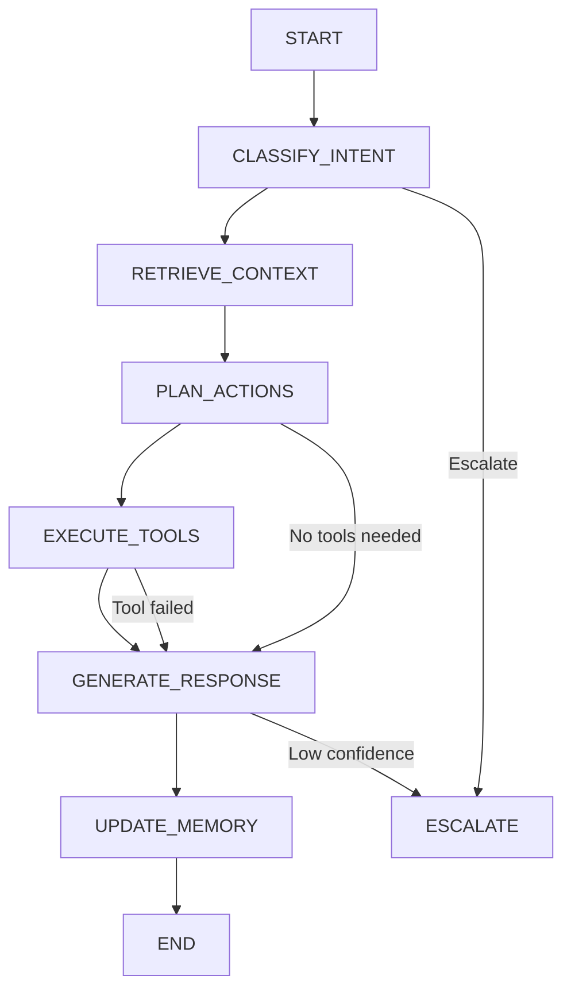

### 8.3 Node Descriptions

| Node | Purpose | Key Logic |
|------|---------|-----------|
| **CLASSIFY_INTENT** | Determine user intent | LLM-based classification with few-shot examples |
| **RETRIEVE_CONTEXT** | Fetch relevant docs | Vector search + rerank, tenant-scoped |
| **PLAN_ACTIONS** | Decide tool usage | LLM planner with tool schemas |
| **EXECUTE_TOOLS** | Run business tools | Parallel execution, error handling, timeout |
| **GENERATE_RESPONSE** | Create final response | LLM with context, tools, history |
| **UPDATE_MEMORY** | Persist conversation | Summarize, extract entities, update long-term memory |
| **ESCALATE** | Human handoff | Create ticket, notify agents, preserve context |

---

## 9. Pipecat Integration Diagram

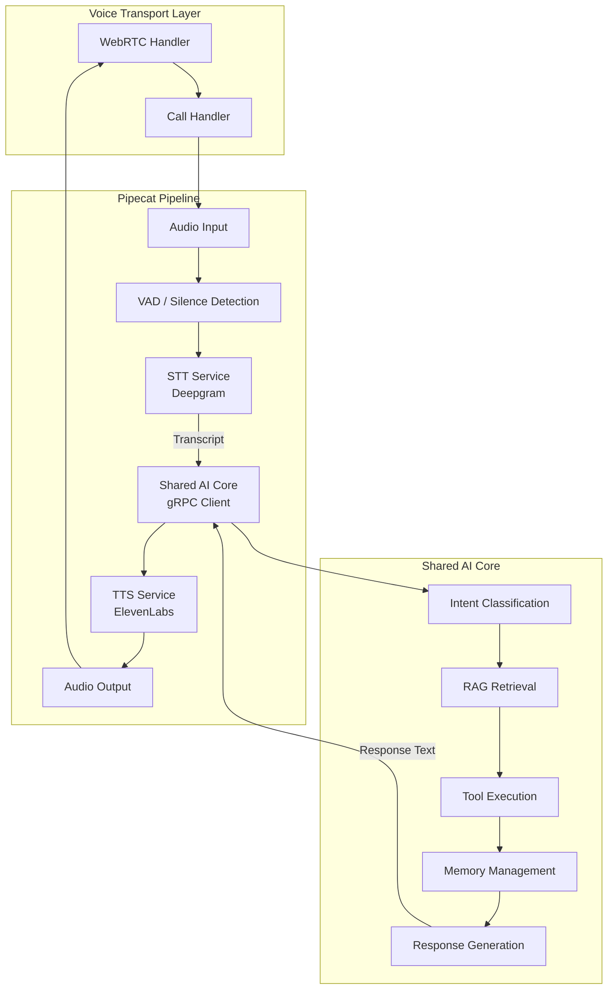

### 9.1 Pipecat Pipeline Configuration

```python
# Pipeline: AudioInput -> VAD -> STT -> AI Core -> TTS -> AudioOutput
pipeline = Pipeline([
    AudioInput(),           # WebRTC audio in
    VAD(),                  # Voice activity detection
    STTService(),           # Deepgram streaming STT
    AICoreService(),        # gRPC call to Shared AI Core
    TTSService(),           # ElevenLabs streaming TTS
    AudioOutput(),          # WebRTC audio out
])
```

### 9.2 Provider Abstractions

| Interface | Implementation | Config |
|-----------|---------------|--------|
| `STTProvider` | `DeepgramSTT`, `AssemblyAI_STT`, `WhisperSTT` | Model, language, interim_results |
| `TTSProvider` | `ElevenLabsTTS`, `CartesiaTTS`, `OpenAITTS` | Voice_id, model, streaming |
| `VoiceTransport` | `PipecatTransport`, `LiveKitTransport` | Pipeline config, codecs |

---

## 10. ShoeFusion Integration Diagram

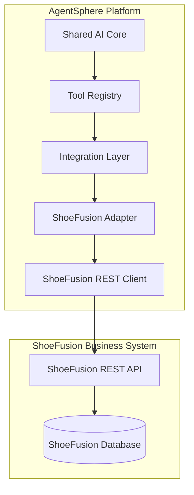

### 10.1 ShoeFusion API Contract (Required Endpoints)

| Endpoint | Method | Purpose | Used By Tool |
|----------|--------|---------|--------------|
| `/api/v1/products` | GET | List/search products | `get_product` |
| `/api/v1/products/{id}` | GET | Get product details | `get_product` |
| `/api/v1/orders` | GET | List/search orders | `get_order` |
| `/api/v1/orders/{id}` | GET | Get order details | `get_order` |
| `/api/v1/inventory/check` | POST | Check stock levels | `check_inventory` |
| `/api/v1/tickets` | POST | Create support ticket | `create_ticket` |
| `/api/v1/customers/{id}` | GET | Get customer profile | `get_customer` |

### 10.2 Tool Definitions

```python
# get_product
{
    "name": "get_product",
    "description": "Retrieve product information from ShoeFusion catalog",
    "parameters": {
        "type": "object",
        "properties": {
            "product_id": {"type": "string", "description": "Product SKU or ID"},
            "query": {"type": "string", "description": "Search query if ID unknown"}
        },
        "required": []
    },
    "returns": {
        "type": "object",
        "properties": {
            "id": {"type": "string"},
            "name": {"type": "string"},
            "description": {"type": "string"},
            "price": {"type": "number"},
            "currency": {"type": "string"},
            "images": {"type": "array", "items": {"type": "string"}},
            "sizes": {"type": "array", "items": {"type": "string"}},
            "colors": {"type": "array", "items": {"type": "string"}},
            "in_stock": {"type": "boolean"},
            "category": {"type": "string"}
        }
    }
}
```

---

## 11. AI Inference Service Layer

The AI Inference Service sits between the Shared AI Core and provider implementations. It owns all prompt execution concerns, decoupling the AI Core from provider-specific details.

### 11.1 Responsibilities

| Responsibility | Description |
|----------------|-------------|
| **Prompt Execution** | Formats prompts, manages templates, handles few-shot examples |
| **Structured Output Parsing** | Enforces JSON schema compliance via Pydantic models, retries on parse failure |
| **Retry Logic** | Exponential backoff, circuit breaker, provider failover |
| **Token Accounting** | Tracks input/output tokens per tenant, per conversation, per model |
| **Guardrails** | Input/output validation, PII detection, toxicity filtering, hallucination checks |
| **Cost Tracking** | Real-time cost calculation per request, aggregated by tenant |
| **Model Routing** | Routes requests to optimal model based on task complexity, cost, latency, tenant config |

### 11.2 Interface

```python
class AIInferenceService(Protocol):
    async def complete(
        self,
        request: CompletionRequest,
        tenant_id: TenantId,
        config: InferenceConfig
    ) -> CompletionResponse:
        """Execute completion with full observability and guardrails"""
    
    async def complete_structured(
        self,
        request: StructuredCompletionRequest,
        response_model: Type[BaseModel],
        tenant_id: TenantId,
        config: InferenceConfig
    ) -> BaseModel:
        """Execute completion with guaranteed structured output"""
    
    async def get_token_usage(
        self,
        tenant_id: TenantId,
        period: DateRange
    ) -> TokenUsageReport:
        """Retrieve aggregated token usage and costs"""
```

### 11.3 Configuration

```python
class InferenceConfig:
    model: str                    # e.g., "gemini-1.5-pro", "gpt-4o"
    temperature: float = 0.7
    max_tokens: int = 4096
    top_p: float = 1.0
    stop_sequences: List[str] = []
    retry_policy: RetryPolicy = RetryPolicy(max_attempts=3, backoff=1.5)
    guardrails: GuardrailConfig = GuardrailConfig(
        pii_detection=True,
        toxicity_threshold=0.8,
        hallucination_check=True
    )
    cost_budget: Optional[CostBudget] = None  # Per-request cost limit
    structured_output: bool = True  # Enforce JSON schema
```

---

## 12. AI Gateway

The AI Gateway sits between the Shared AI Core and the AI Inference Service. It owns all routing, failover, and optimisation concerns.

### 12.1 Responsibilities

| Responsibility | Description |
|----------------|-------------|
| **Model Routing** | Routes requests to the optimal model based on task type (chat, RAG, tool, classification) |
| **Provider Routing** | Routes to the best provider (Gemini, OpenAI, Anthropic, Azure) per tenant config |
| **Failover** | Falls back to secondary provider on timeout/error |
| **Retry Orchestration** | Coordinates retries across providers, not just within one |
| **Cost Optimisation** | Selects cheaper model for simple tasks, premium model for complex |
| **Latency Optimisation** | Routes to fastest provider based on real-time latency measurements |
| **Model Selection** | Resolves tenant `ai_config` to concrete model/version |
| **Fallback Strategy** | Configurable fallback chain (e.g., gemini-pro → gpt-4o → claude-3) |

### 12.2 Flow

```
AI Core
  ↓
AI Gateway
  ├── Check tenant config (model, provider, fallback)
  ├── Check feature flags (model access)
  ├── Select primary provider + model
  ├── Call Prompt Manager → get rendered prompt
  ├── Call AI Inference → execute
  ├── On failure → select fallback → retry
  └── Return response + metadata (model used, cost, latency)
  ↓
AI Core
```

### 12.3 Interface

```python
class AIGateway(Protocol):
    async def complete(
        self,
        request: CompletionRequest,
        tenant_id: TenantId,
        config: AIGatewayConfig
    ) -> GatewayResponse: ...

class AIGatewayConfig:
    primary_provider: str = "gemini"
    primary_model: str = "gemini-1.5-pro"
    fallback_providers: List[FallbackConfig] = [
        FallbackConfig(provider="openai", model="gpt-4o"),
        FallbackConfig(provider="anthropic", model="claude-3-opus"),
    ]
    cost_optimisation: bool = True
    max_latency_ms: int = 5000
    fallback_on_timeout: bool = True

class GatewayResponse:
    text: str
    model_used: str
    provider_used: str
    total_tokens: int
    total_cost: Decimal
    latency_ms: int
    fallback_occurred: bool
```

---

## 13. Prompt Manager

The Prompt Manager is a dedicated service between the AI Gateway and AI Inference Service, responsible for all prompt lifecycle concerns.

### 13.1 Responsibilities

| Responsibility | Description |
|----------------|-------------|
| **System Prompts** | Stores and retrieves base system prompts per tenant |
| **Tenant Prompts** | Manages tenant-customised prompt overrides |
| **Prompt Templates** | Jinja2/Prompt templating with variable injection |
| **Prompt Versioning** | Versioned prompts with migration between versions |
| **Prompt Variables** | Resolves variables (tenant_name, user_name, context, tools) |
| **Prompt Rendering** | Compiles template + variables → final prompt string |
| **Prompt Testing** | Sandbox rendering without executing against LLM |
| **Prompt Caching** | Caches rendered prompts by (template_hash, variables_hash) |

### 13.2 Architecture

```
AI Gateway
  ↓
Prompt Manager
  ├── System Prompt Store
  ├── Tenant Prompt Overrides
  ├── Template Engine (Jinja2)
  ├── Variable Resolver
  └── Render Cache (Redis)
  ↓
AI Inference Service
```

### 13.3 Interface

```python
class PromptManager(Protocol):
    async def render(
        self,
        template_name: str,
        variables: Dict[str, Any],
        tenant_id: TenantId,
        version: Optional[str] = None
    ) -> RenderedPrompt: ...
    
    async def get_prompt(
        self,
        template_name: str,
        tenant_id: TenantId,
        version: Optional[str] = None
    ) -> PromptTemplate: ...
    
    async def create_version(
        self,
        template_name: str,
        content: str,
        tenant_id: TenantId
    ) -> PromptVersion: ...
    
    async def test_render(
        self,
        template_content: str,
        variables: Dict[str, Any]
    ) -> str: ...

class RenderedPrompt:
    text: str
    template_name: str
    version: str
    variables_used: Dict[str, Any]
    token_count: int
    cached: bool

```

---

## 14. Integration Layer - Multi-Protocol Architecture

The Integration Layer supports multiple communication protocols with business systems. Only REST is implemented in Phase 4; others are reserved for future phases.

### 12.1 Protocol Abstraction

```python
class IntegrationProtocol(Protocol):
    """Base protocol for all integration adapters"""
    async def execute_tool(
        self,
        tool_name: str,
        parameters: Dict[str, Any],
        tenant_config: IntegrationConfig
    ) -> ToolResult: ...
    
    async def health_check(self, tenant_config: IntegrationConfig) -> HealthStatus: ...
    
    def get_supported_tools(self) -> List[ToolDefinition]: ...
```

### 12.2 Supported Protocols (Architecture Reserved)

| Protocol | Package | Implementation Status | Use Case |
|----------|---------|----------------------|----------|
| **REST** | `integrations.rest` | ✅ Phase 4 | ShoeFusion, Shopify, WooCommerce, generic REST APIs |
| **Model Context Protocol (MCP)** | `integrations.mcp` | 📋 Reserved | Anthropic MCP servers, standardized tool exposure |
| **GraphQL** | `integrations.graphql` | 📋 Reserved | Shopify Admin API, GitHub, Hasura, custom GraphQL |
| **gRPC** | `integrations.grpc` | 📋 Reserved | Internal microservices, high-performance B2B integrations |

### 12.3 Package Boundaries

```
src/agentsphere/infrastructure/integrations/
├── base.py                 # IntegrationProtocol, IntegrationConfig
├── registry.py             # IntegrationRegistry
├── rest/
│   ├── __init__.py
│   ├── adapter.py          # RESTAdapter implements IntegrationProtocol
│   ├── client.py           # Async HTTP client with auth, retries
│   └── openapi.py          # OpenAPI spec parsing for tool generation
├── mcp/
│   ├── __init__.py
│   ├── adapter.py          # MCPAdapter (future)
│   └── client.py           # MCP client (future)
├── graphql/
│   ├── __init__.py
│   ├── adapter.py          # GraphQLAdapter (future)
│   └── client.py           # GraphQL client (future)
├── grpc/
│   ├── __init__.py
│   ├── adapter.py          # GRPCAdapter (future)
│   └── client.py           # gRPC client (future)
├── shoefusion/
│   ├── __init__.py
│   ├── adapter.py          # ShoeFusionAdapter extends RESTAdapter
│   ├── client.py           # ShoeFusionRESTClient
│   ├── tools/              # Tool implementations
│   └── mappings.py         # Response transformation
└── custom/
    └── __init__.py         # Base classes for custom integrations
```

### 12.4 Adapter Pattern

Each business system implements an adapter extending the protocol-specific base:

```python
class ShoeFusionAdapter(RESTAdapter):
    """ShoeFusion-specific REST adapter"""
    
    def get_supported_tools(self) -> List[ToolDefinition]:
        return [
            ToolDefinition(name="get_product", ...),
            ToolDefinition(name="get_order", ...),
            ToolDefinition(name="check_inventory", ...),
            ToolDefinition(name="create_ticket", ...),
        ]
    
    async def execute_tool(
        self,
        tool_name: str,
        parameters: Dict[str, Any],
        tenant_config: IntegrationConfig
    ) -> ToolResult:
        # Map tool_name to specific client method
        # Transform response to structured ToolResult
        ...
```

---

## 15. Event Bus Architecture

The Event Bus decouples domain events from asynchronous processing. Domain events are published by the AI Core and Integration Layer; consumers subscribe for analytics, audit logging, notifications, and background work.

### 13.1 Domain Events

```python
# Core domain events
class MessageGenerated(DomainEvent):
    conversation_id: ConversationId
    tenant_id: TenantId
    message_id: MessageId
    role: str  # "assistant"
    tokens_used: int
    model: str
    latency_ms: int

class ToolExecuted(DomainEvent):
    conversation_id: ConversationId
    tenant_id: TenantId
    tool_name: str
    parameters: Dict[str, Any]
    result: ToolResult
    latency_ms: int
    success: bool

class ConversationEnded(DomainEvent):
    conversation_id: ConversationId
    tenant_id: TenantId
    user_id: UserId
    duration_seconds: int
    message_count: int
    escalated: bool
    satisfaction_score: Optional[float]

class DocumentIngested(DomainEvent):
    tenant_id: TenantId
    document_id: DocumentId
    chunk_count: int
    embedding_model: str
```

### 13.2 Event Bus Protocol Abstraction

The Event Bus is defined as an application port. The Shared AI Core depends only on `EventBus(Protocol)`, never on a concrete implementation.

```python
# Application port (in application/ports/)
class EventBus(Protocol):
    """Application port — Core depends only on this"""
    
    async def publish(self, event: DomainEvent) -> None: ...
    
    async def subscribe(
        self,
        tenant_id: TenantId,
        consumer_group: str,
        handler: Callable[[DomainEvent], Awaitable[None]]
    ) -> None: ...
    
    async def close(self) -> None: ...
```

### 13.3 Infrastructure Implementations

| Implementation | Transport | Status | Use Case |
|----------------|-----------|--------|----------|
| **RedisEventBus** | Redis Streams | ✅ Phase 1 | Default in-memory/Redis, dev & small deployments |
| **KafkaEventBus** | Apache Kafka | 📋 Future | High-throughput production, multi-region |
| **RabbitMQEventBus** | RabbitMQ | 📋 Future | Existing infrastructure, AMQP ecosystems |
| **NATSEventBus** | NATS | 📋 Future | Lightweight cloud-native, edge deployments |

```python
# Infrastructure implementation (in infrastructure/event_bus/)
class RedisEventBus:
    """Redis Streams implementation of EventBus port"""
    
    def __init__(self, redis_client: Redis):
        self._redis = redis_client
    
    async def publish(self, event: DomainEvent) -> None:
        stream = f"events:{event.tenant_id}"
        await self._redis.xadd(stream, event.model_dump_json())
    
    async def subscribe(
        self,
        tenant_id: TenantId,
        consumer_group: str,
        handler: Callable[[DomainEvent], Awaitable[None]]
    ) -> None:
        stream = f"events:{tenant_id}"
        # Create consumer group, read messages, call handler
        ...
```

### 13.4 Consumer Groups

| Consumer Group | Handled Events | Purpose |
|----------------|----------------|---------|
| `analytics` | `MessageGenerated`, `ToolExecuted`, `ConversationEnded` | Aggregate metrics, token usage, conversation analytics |
| `audit` | All events | Immutable audit trail, compliance logging |
| `notifications` | `ConversationEnded`, `EscalationTriggered` | Webhooks, email, Slack, PagerDuty |
| `workers` | `DocumentIngested`, `EmbeddingRequested` | Background embedding generation, document reprocessing |

### 13.4 Event Flow

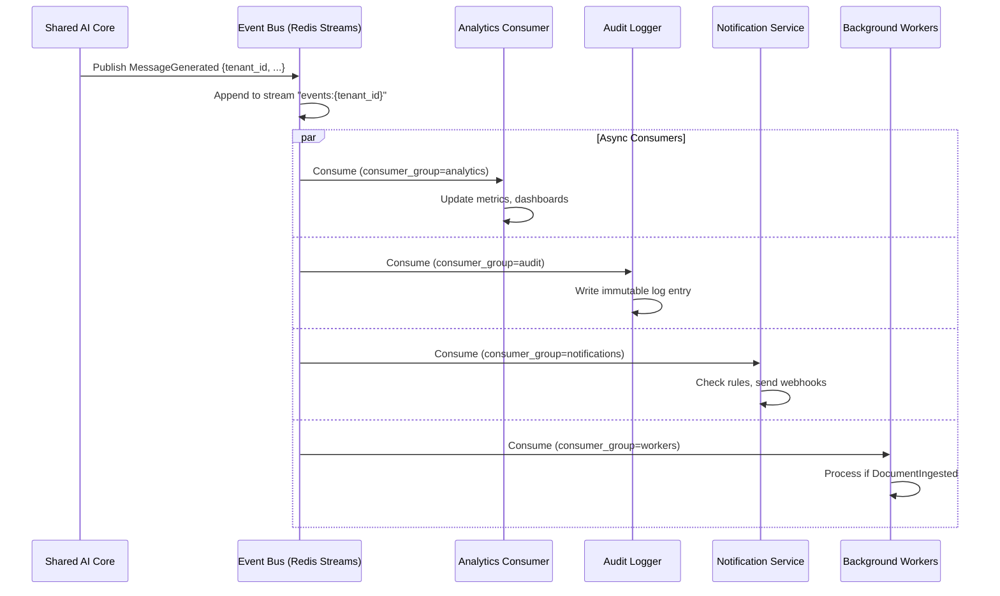

---

## 16. AI Memory Architecture

The memory system is split into four distinct stores, each with different retention, access patterns, and purposes.

### 14.1 Memory Types

| Memory Type | Scope | Retention | Access Pattern | Use Case |
|-------------|-------|-----------|----------------|----------|
| **Short-Term** | Conversation | Session (TTL: 24h) | Full history, last N messages | Immediate context, few-shot examples |
| **Long-Term** | User + Tenant | Indefinite | Key-value, semantic search | User preferences, facts, entity profiles |
| **Conversation Summaries** | Conversation | Indefinite | Chronological, hierarchical | Compress history, reduce token usage |
| **Semantic Memory** | Tenant | Indefinite | Vector similarity | Learned patterns, FAQs, resolutions |

### 14.2 Memory Interfaces

```python
class MemoryManager(Protocol):
    # Short-term (Redis)
    async def append_message(
        self,
        conversation_id: ConversationId,
        message: Message
    ) -> None: ...
    
    async def get_recent_messages(
        self,
        conversation_id: ConversationId,
        limit: int = 20
    ) -> List[Message]: ...
    
    # Long-term (PostgreSQL)
    async def upsert_user_fact(
        self,
        tenant_id: TenantId,
        user_id: UserId,
        fact: UserFact
    ) -> None: ...
    
    async def get_user_facts(
        self,
        tenant_id: TenantId,
        user_id: UserId,
        category: Optional[str] = None
    ) -> List[UserFact]: ...
    
    # Summaries (PostgreSQL)
    async def create_summary(
        self,
        conversation_id: ConversationId,
        summary: ConversationSummary
    ) -> None: ...
    
    async def get_summaries(
        self,
        conversation_id: ConversationId
    ) -> List[ConversationSummary]: ...
    
    # Semantic (pgvector)
    async def store_semantic_memory(
        self,
        tenant_id: TenantId,
        memory: SemanticMemory
    ) -> None: ...
    
    async def search_semantic_memory(
        self,
        tenant_id: TenantId,
        query: str,
        limit: int = 5
    ) -> List[SemanticMemory]: ...
```

### 14.3 Memory Flow in LangGraph

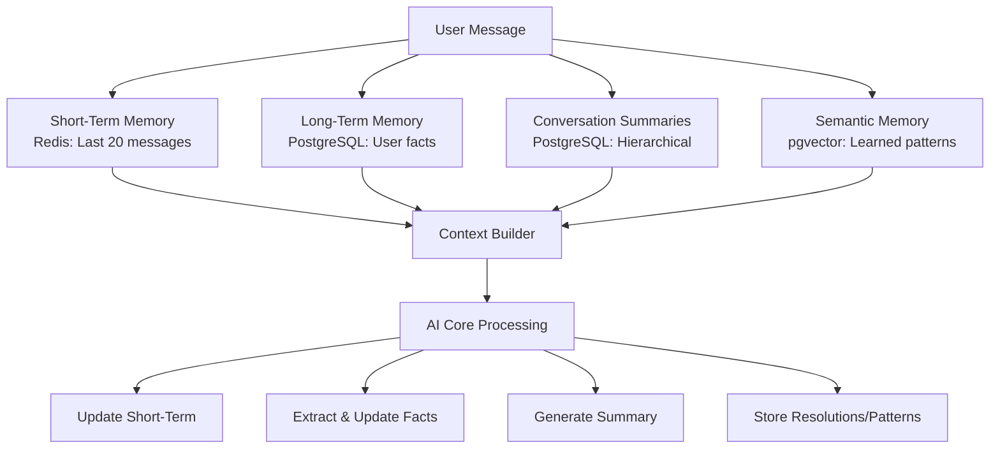

---

## 17. RAG Pipeline - Refined Stages

The RAG pipeline is decomposed into discrete, testable stages. Each stage is a separate component with its own interface.

### 15.1 Pipeline Stages

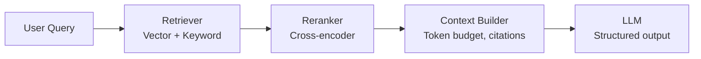

### 15.2 Stage Interfaces

```python
# Stage 1: Retrieval
class Retriever(Protocol):
    async def retrieve(
        self,
        query: str,
        tenant_id: TenantId,
        config: RetrievalConfig
    ) -> List[DocumentChunk]: ...

class RetrievalConfig:
    top_k: int = 20
    search_type: SearchType = SearchType.HYBRID  # VECTOR | KEYWORD | HYBRID
    filters: Dict[str, Any] = {}  # document_type, date_range, tags
    score_threshold: float = 0.5

# Stage 2: Reranking
class Reranker(Protocol):
    async def rerank(
        self,
        query: str,
        chunks: List[DocumentChunk],
        config: RerankConfig
    ) -> List[DocumentChunk]: ...

class RerankConfig:
    top_k: int = 8
    model: str = "cross-encoder/ms-marco-MiniLM-L-6-v2"
    batch_size: int = 32

# Stage 3: Context Building
class ContextBuilder(Protocol):
    def build(
        self,
        chunks: List[DocumentChunk],
        config: ContextConfig
    ) -> ContextWindow: ...

class ContextConfig:
    max_tokens: int = 4096
    reserve_tokens: int = 1024  # For response
    include_citations: bool = True
    chunk_template: str = "[DOC {doc_id}] {content}"
    separator: str = "\n---\n"

class ContextWindow:
    text: str
    citations: List[Citation]
    token_count: int
    truncated: bool
```

### 15.3 Tenant-Scoped Configuration

Each tenant configures their RAG pipeline via `AI_CONFIG.rag_config`:

```json
{
  "retrieval": {
    "top_k": 20,
    "search_type": "hybrid",
    "score_threshold": 0.6
  },
  "reranking": {
    "enabled": true,
    "top_k": 8,
    "model": "cross-encoder/ms-marco-MiniLM-L-6-v2"
  },
  "context": {
    "max_tokens": 4096,
    "include_citations": true
  },
  "chunking": {
    "strategy": "recursive",
    "chunk_size": 512,
    "chunk_overlap": 50
  }
}
```

---

## 18. Tenant Identity Resolution - Security Rule

**CRITICAL ARCHITECTURAL RULE**: Tenant identity MUST always be resolved from trusted authentication middleware. Never trust client-supplied `tenant_id` in request payloads.

### 16.1 Resolution Flow

```
Request → Auth Middleware (JWT/API Key) → Extract tenant_id → 
Tenant Middleware (validate active, load config) → 
Attach to request.state.tenant_id → 
All downstream handlers read from request.state
```

### 16.2 Implementation

```python
# Middleware order (critical)
app.add_middleware(AuthMiddleware)        # 1. Validates JWT/API Key, extracts claims
app.add_middleware(TenantMiddleware)      # 2. Loads tenant, validates active, attaches config
app.add_middleware(RateLimitMiddleware)   # 3. Per-tenant rate limiting
app.add_middleware(RBACMiddleware)        # 4. Permission checks

# In route handlers - NEVER accept tenant_id from body/query
@app.post("/api/v1/conversations/{id}/messages")
async def send_message(
    request: Request,
    conversation_id: ConversationId,
    message: MessageCreate,
    tenant_id: TenantId = Depends(get_current_tenant_id)  # From request.state
):
    # tenant_id is guaranteed valid and authorized
    ...
```

### 16.3 Forbidden Patterns

```python
# ❌ NEVER DO THIS
async def send_message(
    tenant_id: str = Body(...),  # Client-controlled!
    message: MessageCreate
): ...

# ❌ NEVER DO THIS  
async def send_message(
    request: Request,
    tenant_id: str = Query(...)  # Client-controlled!
): ...
```

---

## 19. Tool Definition Standards

Tools are first-class code artifacts with strict standards for versioning, schemas, execution, and error handling.

### 17.1 Versioned Tool Definitions

```python
# src/agentsphere/domain/tools/definitions/get_product_v1.py
class GetProductV1(BaseTool):
    """Version 1 - Initial release"""
    version = "1.0.0"
    name = "get_product"
    description = "Retrieve product information from business catalog"
    
    class Parameters(BaseModel):
        product_id: Optional[str] = Field(None, description="Product SKU or ID")
        query: Optional[str] = Field(None, description="Search query if ID unknown")
    
    class Returns(BaseModel):
        id: str
        name: str
        description: str
        price: float
        currency: str
        images: List[str]
        sizes: List[str]
        colors: List[str]
        in_stock: bool
        category: str

    async def execute(
        self,
        params: Parameters,
        tenant_id: TenantId,
        context: ToolExecutionContext
    ) -> Returns: ...

# src/agentsphere/domain/tools/definitions/get_product_v2.py
class GetProductV2(GetProductV1):
    """Version 2 - Added inventory_location field"""
    version = "2.0.0"
    
    class Returns(GetProductV1.Returns):
        inventory_location: Optional[str] = Field(None, description="Warehouse location")
```

### 17.2 Registration with Versioning

```python
class ToolRegistry:
    def __init__(self):
        self._tools: Dict[str, Dict[str, BaseTool]] = {}  # name -> version -> tool
    
    def register(self, tool: BaseTool) -> None:
        if tool.name not in self._tools:
            self._tools[tool.name] = {}
        self._tools[tool.name][tool.version] = tool
    
    def get_latest(self, name: str) -> BaseTool:
        versions = self._tools.get(name, {})
        return max(versions.values(), key=lambda t: t.version)
    
    def get_version(self, name: str, version: str) -> BaseTool:
        return self._tools[name][version]
```

### 17.3 Idempotency

Tools that mutate state (create_ticket, place_order) MUST be idempotent:

```python
class CreateTicketTool(BaseTool):
    class Parameters(BaseModel):
        idempotency_key: str = Field(..., description="Client-generated unique key")
        subject: str
        description: str
        priority: Priority = Priority.MEDIUM
    
    async def execute(self, params, tenant_id, context):
        # Check if ticket already created with this key
        existing = await self.ticket_repo.find_by_idempotency_key(
            params.idempotency_key, tenant_id
        )
        if existing:
            return self.Returns(ticket_id=existing.id, status="already_created")
        
        # Create new ticket
        ticket = await self.client.create_ticket(...)
        await self.ticket_repo.save(ticket, params.idempotency_key)
        return self.Returns(ticket_id=ticket.id, status="created")
```

### 17.4 Structured Error Objects

All tool failures return structured errors, never raise exceptions:

```python
class ToolResult(BaseModel):
    success: bool
    data: Optional[Any] = None
    error: Optional[ToolError] = None

class ToolError(BaseModel):
    code: str                    # MACHINE_READABLE_CODE
    message: str                 # Human-readable
    details: Dict[str, Any] = {} # Additional context
    retryable: bool = False      # Can caller retry?
    retry_after_seconds: Optional[int] = None

# Example error codes
TOOL_ERROR_CODES = {
    "INTEGRATION_UNAVAILABLE": "Business system unreachable",
    "INVALID_PARAMETERS": "Parameter validation failed",
    "NOT_FOUND": "Requested resource not found",
    "PERMISSION_DENIED": "Tenant lacks access to this tool",
    "RATE_LIMITED": "Business API rate limit exceeded",
    "IDEMPOTENCY_CONFLICT": "Duplicate idempotency key",
}
```

---

## 20. Feature Flag System

Feature flags control capability availability per tenant without code changes.

### 24.1 Architecture

```
AI Core / Transport / Integration
       ↓
FeatureFlagService.check(tenant_id, feature_name)
       ↓
     PostgreSQL (tenant.feature_flags JSONB)
```

### 24.2 Tenant-Scoped Flags

| Feature | Flag Key | Default | Description |
|---------|----------|---------|-------------|
| Voice | `voice.enabled` | false | Enable Pipecat voice calls |
| RAG | `rag.enabled` | true | Enable knowledge base retrieval |
| Billing | `billing.enabled` | false | Enable subscription/usage tracking |
| Analytics | `analytics.enabled` | true | Enable conversation analytics |
| Knowledge Base | `knowledge_base.enabled` | true | Enable document management |
| Future Channels | `channels.whatsapp`, `channels.slack` | false | Per-channel toggles |
| Evaluation | `evaluation.enabled` | false | Enable AI evaluation metrics |
| Tool X | `tools.{tool_name}.enabled` | true | Per-tool enable/disable |

### 22.3 Interface

```python
class FeatureFlagService(Protocol):
    async def is_enabled(
        self,
        tenant_id: TenantId,
        feature: str,
        default: bool = False
    ) -> bool: ...
    
    async def set_flag(
        self,
        tenant_id: TenantId,
        feature: str,
        enabled: bool
    ) -> None: ...
    
    async def get_all_flags(
        self,
        tenant_id: TenantId
    ) -> Dict[str, bool]: ...

class FeatureFlagMiddleware:
    """Rejects requests for disabled features before reaching handlers"""
    async def __call__(self, request: Request, call_next):
        feature = request.headers.get("X-Feature")
        if feature and not await flag_service.is_enabled(tenant_id, feature):
            raise FeatureDisabledException(feature)
        return await call_next(request)
```

### 18.4 Storage

Flags are stored in the `tenant` table's `feature_flags` JSONB column. No separate table needed.

```json
{
  "tenant": {
    "feature_flags": {
      "voice.enabled": true,
      "rag.enabled": true,
      "billing.enabled": false,
      "channels.slack": true
    }
  }
}
```

---

## 21. Human Escalation Module

Escalation is a dedicated subsystem. The AI Core never knows which escalation channel is used.

### 23.1 Architecture

```
AI Core → Publishes EscalationTriggered event
                         ↓
              Event Bus (events:{tenant_id})
                         ↓
              Escalation Service
                           ├── Slack Handler
                           ├── Email Handler
                           ├── Zendesk Handler
                           ├── Freshdesk Handler
                           ├── Webhook Handler
                           └── (Future CRM integrations)
```

### 23.2 Flow

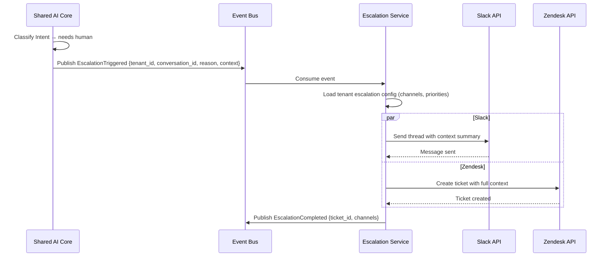

### 19.3 Escalation Event

```python
class EscalationTriggered(DomainEvent):
    tenant_id: TenantId
    conversation_id: ConversationId
    user_id: UserId
    reason: str
    priority: EscalationPriority  # LOW, MEDIUM, HIGH, CRITICAL
    context: ConversationContext  # Last N messages, intent, RAG chunks, tool results
    suggested_action: Optional[str]

class EscalationConfig(BaseModel):
    channels: List[EscalationChannel]  # slack, email, zendesk, freshdesk, webhook
    default_priority: EscalationPriority = EscalationPriority.MEDIUM
    include_full_context: bool = True
    auto_assign: Optional[str] = None  # User/group to assign
```

---

## 22. AI Evaluation Module

The AI Evaluation subsystem measures conversation quality independently from the AI Core.

### 24.1 Metrics

| Metric | Description | Source |
|--------|-------------|--------|
| **Latency** | P50/P95/P99 response time | AI Session Recorder |
| **Prompt Tokens** | Input tokens per turn | AI Inference Service |
| **Completion Tokens** | Output tokens per turn | AI Inference Service |
| **Cost** | Per-turn and per-conversation cost | AI Inference Service |
| **Hallucination Score** | % of claims not grounded in context | LLM-as-judge |
| **Confidence Score** | Model's confidence in response | LLM metadata |
| **Groundedness** | % of response supported by RAG chunks | LLM-as-judge |
| **Safety Score** | Toxicity, PII, harmful content flagging | Guardrail output |
| **Response Quality** | Relevance, helpfulness, tone | LLM-as-judge + human |

### 24.2 Architecture

```
AI Session Recorder → Raw session data
                           ↓
              AI Evaluation Service
                ├── LatencyEvaluator
                ├── TokenUsageEvaluator
                ├── CostEvaluator
                ├── LLMJudge (hallucination, groundedness, quality)
                ├── SafetyEvaluator
                └── ConfidenceEvaluator
                           ↓
              EvaluationStore (separate from conversations)
                           ↓
              Dashboard / API
```

### 22.3 Storage

```sql
CREATE TABLE evaluation (
    id UUID PRIMARY KEY,
    tenant_id UUID NOT NULL REFERENCES tenant(id),
    conversation_id UUID NOT NULL REFERENCES conversation(id),
    message_id UUID NOT NULL REFERENCES message(id),
    metric VARCHAR(64) NOT NULL,    -- latency, hallucination, groundedness, etc.
    score FLOAT NOT NULL,
    metadata JSONB,                  -- evaluator-specific details
    created_at TIMESTAMP NOT NULL DEFAULT NOW()
);

CREATE INDEX idx_evaluation_tenant ON evaluation(tenant_id);
CREATE INDEX idx_evaluation_conversation ON evaluation(conversation_id);
CREATE INDEX idx_evaluation_metric ON evaluation(tenant_id, metric, created_at);
```

### 22.4 Evaluator Interface

```python
class Evaluator(Protocol):
    async def evaluate(
        self,
        session: RecordedSession,
        tenant_id: TenantId
    ) -> List[EvaluationResult]: ...

class EvaluationResult(BaseModel):
    metric: str
    score: float
    threshold: Optional[float]
    passed: bool
    details: Dict[str, Any]
```

---

## 23. AI Session Recorder

The Session Recorder captures every detail of a conversation turn for debugging, replay, and evaluation.

### 23.1 Recorded Data

| Field | Description |
|-------|-------------|
| `conversation_id` | Conversation identifier |
| `turn_id` | Sequential turn number |
| `timestamp` | When the turn occurred |
| `user_message` | Raw user input |
| `intent` | Classified intent |
| `rag_query` | Query sent to RAG |
| `rag_chunks` | Retrieved document chunks (with scores) |
| `plan` | AI's planned actions |
| `tool_calls` | Array of tool calls + parameters + results |
| `prompt_sent` | Full rendered prompt sent to LLM |
| `raw_response` | Raw LLM response |
| `final_response` | Processed response sent to user |
| `model_used` | Model that generated the response |
| `provider_used` | Provider that served the request |
| `tokens_input` | Input token count |
| `tokens_output` | Output token count |
| `cost` | Cost of the turn |
| `latency_ms` | End-to-end latency |
| `errors` | Any errors encountered |
| `guardrails_triggered` | Guardrails that fired |

### 23.2 Replay Capability

```python
class SessionRecorder(Protocol):
    async def start_turn(
        self,
        conversation_id: ConversationId,
        tenant_id: TenantId
    ) -> TurnContext: ...
    
    async def record(
        self,
        context: TurnContext,
        event: RecordingEvent
    ) -> None: ...
    
    async def complete_turn(
        self,
        context: TurnContext
    ) -> RecordedTurn: ...
    
    async def replay(
        self,
        conversation_id: ConversationId,
        from_turn: Optional[int] = None
    ) -> AsyncIterator[RecordedTurn]: ...
    
    async def get_timeline(
        self,
        conversation_id: ConversationId
    ) -> List[TimelineEvent]: ...

class RecordingEvent:
    type: Literal["rag_chunks", "tool_call", "tool_result", "prompt", "response", "error"]
    payload: Any
    timestamp: float
```

### 23.3 Timeline View

Each conversation is presented as a timeline:

```
Turn 1 (2026-07-09 10:00:00.000)
  ├── User: "What's the status of my order SHOE-1234?"
  ├── Intent: order_status
  ├── RAG: No docs retrieved
  ├── Tool: get_order(order_id="SHOE-1234") → {status: shipped, eta: 2026-07-11}
  ├── Prompt: [system prompt + tool result] (1,234 tokens)
  ├── Response: "Your order SHOE-1234 is shipped and expected by July 11."
  └── Latency: 847ms | Cost: $0.0023

Turn 2 (2026-07-09 10:00:01.200)
  ├── User: "Can I change the delivery address?"
  ├── Intent: modify_order
  ├── Escalation: HIGH priority → Zendesk ticket #4567 created
  └── Latency: 1,234ms | Cost: $0.0031
```

### 23.4 Storage Strategy

Session recordings are stored in a separate `session_recording` table (not in `message` or `conversation` tables) to keep conversation tables lightweight. Retention policy: 90 days for hot storage, archival to cold storage after.

```sql
CREATE TABLE session_recording (
    id UUID PRIMARY KEY,
    tenant_id UUID NOT NULL REFERENCES tenant(id),
    conversation_id UUID NOT NULL,
    turn_number INT NOT NULL,
    data JSONB NOT NULL,  -- Full recording data
    compressed BOOLEAN DEFAULT FALSE,
    expires_at TIMESTAMP NOT NULL,
    created_at TIMESTAMP NOT NULL DEFAULT NOW()
);

CREATE INDEX idx_recording_conv ON session_recording(tenant_id, conversation_id, turn_number);
```

---

## 24. Frontend Architecture

### 24.1 Structure

```
frontend/
├── app/
│   ├── layout.tsx              # Root layout with providers
│   ├── page.tsx                # Landing/redirect
│   └── globals.css
├── components/
│   ├── ui/                     # Shared UI components (Button, Input, Card, Modal, etc.)
│   ├── layout/                 # Sidebar, Header, Nav, Shell
│   └── common/                 # Avatar, Badge, StatusIndicator, Loading
├── features/
│   ├── chat/
│   │   ├── components/         # ChatBubble, MessageList, InputBar
│   │   ├── hooks/              # useChat, useWebSocket
│   │   ├── services/           # chatService.ts
│   │   └── types/              # chat.ts
│   ├── voice/
│   │   ├── components/         # CallButton, CallStatus, Transcript
│   │   ├── hooks/              # useVoiceCall, useWebRTC
│   │   └── types/
│   ├── knowledge/
│   │   ├── components/         # DocumentList, Uploader, SearchBar
│   │   ├── hooks/              # useDocuments, useSearch
│   │   └── types/
│   ├── admin/
│   │   ├── components/         # TenantSettings, UserManagement
│   │   ├── hooks/
│   │   └── types/
│   └── analytics/
│       ├── components/         # Dashboard, Chart, MetricCard
│       ├── hooks/
│       └── types/
├── hooks/                      # Global hooks (useAuth, useTenant, useFeatureFlag)
├── providers/
│   ├── AuthProvider.tsx
│   ├── TenantProvider.tsx
│   ├── WebSocketProvider.tsx
│   └── FeatureFlagProvider.tsx
├── contexts/                   # React contexts
├── services/                   # API clients (api.ts, auth.ts, ws.ts)
├── lib/                        # Utilities (utils.ts, formatters.ts)
├── types/                      # Shared TypeScript types
└── styles/                     # Theme, variables, mixins
```

### 24.2 Architecture Principles

- **Feature-based** grouping, not type-based
- **Server Components** where possible, Client Components only for interactivity
- **React Context** for global state (auth, tenant, WS)
- **React Query/SWR** for server state
- **WebSocket** via a shared provider for real-time
- **Feature flags** drive UI visibility (hide voice tab if flag disabled)

---

## 25. CI/CD Architecture - Quality Gates

The CI/CD pipeline enforces code quality, security, and reliability at every stage.

### 24.1 Pipeline Stages

```yaml
# .github/workflows/ci.yml
stages:
  - name: "Lint & Format"
    tools:
      - ruff check .           # Fast linting (replaces flake8, isort, pyupgrade)
      - ruff format --check .  # Formatting (replaces black)
      - isort --check .        # Import sorting
  
  - name: "Type Check"
    tools:
      - mypy --strict src/     # Strict type checking
  
  - name: "Unit Tests"
    tools:
      - pytest tests/unit -v --cov=src --cov-fail-under=80
  
  - name: "Integration Tests"
    tools:
      - pytest tests/integration -v
      - Requires: PostgreSQL, Redis, test AI provider keys
  
  - name: "Security Scan"
    tools:
      - pip-audit              # Dependency vulnerability scanning
      - bandit -r src/         # Static security analysis
      - trivy fs .             # Filesystem vulnerability scan
      - detect-secrets scan    # Secret scanning
  
  - name: "Build"
    tools:
      - docker build -t agentsphere/api:${GITHUB_SHA} -f docker/Dockerfile.api .
      - docker build -t agentsphere/worker:${GITHUB_SHA} -f docker/Dockerfile.worker .
  
  - name: "E2E Tests"
    tools:
      - pytest tests/e2e -v
      - Runs against staging deployment
  
  - name: "Deploy"
    if: github.ref == 'refs/heads/main'
    tools:
      - kubectl apply -k kubernetes/overlays/prod
      - Helm upgrade for production
```

### 24.2 Pre-commit Hooks

```yaml
# .pre-commit-config.yaml
repos:
  - repo: https://github.com/astral-sh/ruff-pre-commit
    rev: v0.4.0
    hooks:
      - id: ruff
        args: [--fix]
      - id: ruff-format
  
  - repo: https://github.com/pycqa/isort
    rev: 5.13.0
    hooks:
      - id: isort
  
  - repo: https://github.com/pre-commit/mirrors-mypy
    rev: v1.10.0
    hooks:
      - id: mypy
        args: [--strict]
  
  - repo: https://github.com/zricethezav/gitleaks
    rev: v8.18.0
    hooks:
      - id: gitleaks
  
  - repo: https://github.com/Yelp/detect-secrets
    rev: v1.5.0
    hooks:
      - id: detect-secrets
```

### 24.3 Quality Gate Thresholds

| Metric | Threshold | Enforcement |
|--------|-----------|-------------|
| Test Coverage | ≥ 80% | CI fails if below |
| Type Coverage | 100% (strict mode) | mypy --strict |
| Ruff Errors | 0 | CI fails on any |
| Vulnerabilities | 0 Critical/High | pip-audit, Trivy |
| Secrets | 0 | detect-secrets, gitleaks |
| Complexity | ≤ 10 (cyclomatic) | Ruff `C901` |

### 24.4 Dependency Management

```toml
# pyproject.toml
[tool.uv]
dev-dependencies = [
    "ruff==0.4.0",
    "mypy==1.10.0",
    "pytest==8.2.0",
    "pytest-asyncio==0.23.0",
    "pytest-cov==5.0.0",
    "pytest-mock==3.14.0",
    "bandit==1.7.0",
    "pip-audit==2.7.0",
    "detect-secrets==1.5.0",
    "gitleaks==8.18.0",
    "pre-commit==3.7.0",
]

[tool.mypy]
strict = true
warn_return_any = true
warn_unused_configs = true
disallow_untyped_defs = true
disallow_incomplete_defs = true
check_untyped_defs = true
no_implicit_optional = true
warn_redundant_casts = true
warn_unused_ignores = true

[tool.ruff]
line-length = 100
target-version = "py311"
select = ["E", "F", "I", "N", "W", "UP", "B", "C4", "T20", "PTH", "ERA", "PD", "PGH", "PL", "TRY", "NPY", "RSE", "RET", "SIM", "TCH", "ARG", "ASYNC", "LOG"]
ignore = []

[tool.ruff.format]
quote-style = "double"
indent-style = "space"
skip-magic-trailing-comma = false

[tool.isort]
profile = "black"
line_length = 100
multi_line_output = 3
```

---

## 26. Technology Decision Records (ADRs)

### ADR Index

| ADR | Title | Section |
|-----|-------|---------|
| ADR-001 | Clean Architecture | §26 |
| ADR-002 | FastAPI | §26 |
| ADR-003 | PostgreSQL + pgvector | §26 |
| ADR-004 | Pipecat Voice Architecture | §26 |
| ADR-005 | Provider Abstractions | §26 |
| ADR-006 | Multi-Tenancy | §26 |
| ADR-007 | LangGraph | §26 |
| ADR-008 | Redis Strategy | §26 |
| ADR-009 | Event Bus | §26 |
| ADR-010 | AI Inference Service | §26 |
| ADR-011 | AI Provider Independence | §26 |
| ADR-012 | Async-First Architecture | §26 |
| ADR-013 | Structured Logging with Correlation IDs | §26 |
| ADR-014 | Configuration via Pydantic Settings | §26 |
| ADR-015 | Tool Definitions as Code | §26 |
| ADR-016 | Four-Tier Memory Architecture | §26 |
| ADR-017 | RAG Pipeline as Discrete Stages | §26 |
| ADR-018 | Trusted Tenant Resolution Only | §26 |
| ADR-019 | Versioned Tool Definitions | §26 |
| ADR-020 | Structured Tool Errors with Idempotency | §26 |
| ADR-021 | Comprehensive CI/CD Quality Gates | §26 |
| ADR-022 | Prompt Manager | §26 |
| ADR-023 | AI Gateway | §26 |
| ADR-024 | EventBus Abstraction | §26 |
| ADR-025 | Versioned Tool Registry | §26 |
| ADR-026 | AI Evaluation | §26 |
| ADR-027 | Feature Flags | §26 |
| ADR-028 | Human Escalation | §26 |
| ADR-029 | API Strategy | §26 |
| ADR-030 | Frontend Architecture | §26 |
| ADR-031 | AI Session Recorder | §26 |
| ADR-032 | API First Development | §26 |

---

### ADR-001: Clean Architecture
**Status**: Accepted  
**Context**: Application must be independent of frameworks, databases, and external services. Business rules must be testable in isolation.  
**Decision**: Apply Clean Architecture with Domain → Application (Use Cases) → Infrastructure → Interfaces layers. Dependencies point inward. Domain knows nothing about FastAPI, PostgreSQL, or AI providers.  
**Consequences**: Indirection between layers, but complete testability and framework independence.

### ADR-002: FastAPI for API Layer
**Status**: Accepted  
**Context**: Need async, high-performance API framework with automatic OpenAPI generation  
**Decision**: FastAPI with Pydantic v2  
**Consequences**: Excellent async support, type safety, auto-docs, but requires Python 3.9+

### ADR-003: PostgreSQL + pgvector for Vector Storage
**Status**: Accepted  
**Context**: Need ACID compliance, tenant isolation, and vector search in one database  
**Decision**: pgvector extension over Pinecone/Weaviate/Qdrant  
**Consequences**: Single DB operational model, tenant-scoped queries via RLS, but less specialized vector features

### ADR-004: Pipecat for Voice Orchestration Only
**Status**: Accepted  
**Context**: Voice pipeline management is complex (VAD, STT, TTS, interruption handling)  
**Decision**: Pipecat handles ONLY audio pipeline; AI Core handles all business logic  
**Consequences**: Clean separation, Pipecat swapability, but requires gRPC bridge

### ADR-005: Provider Abstractions for All External Services
**Status**: Accepted  
**Context**: Avoid vendor lock-in, enable testing, support multi-provider strategies  
**Decision**: Define interfaces (Ports) for LLM, Embedding, Reranker, STT, TTS, Vector Store, Cache, Business Adapters  
**Consequences**: More upfront code, but complete flexibility and testability

### ADR-006: Multi-tenancy via Row-Level Security (RLS)
**Status**: Accepted  
**Context**: Must enforce tenant isolation at database level  
**Decision**: PostgreSQL RLS policies + application-level tenant_id propagation  
**Consequences**: Defense in depth, zero-trust data access, but requires careful migration design

### ADR-007: LangGraph for AI Workflow Orchestration
**Status**: Accepted  
**Context**: Need stateful, controllable agent workflows with human-in-the-loop  
**Decision**: LangGraph over LangChain Agents or custom orchestration  
**Consequences**: Explicit state management, visualization, checkpoints, but learning curve

### ADR-008: Redis Strategy
**Status**: Accepted  
**Context**: Need caching, session storage, rate limiting, and event streaming  
**Decision**: Redis for conversation cache (TTL), embedding cache, rate limiting counters, and Redis Streams for Event Bus  
**Consequences**: Single infrastructure dependency for multiple concerns, but requires Redis Cluster for HA in production

### ADR-009: Event Bus for Async Domain Processing
**Status**: Accepted  
**Context**: Analytics, audit logging, notifications, background work must not block AI Core  
**Decision**: Redis Streams with consumer groups for domain event distribution  
**Consequences**: Loose coupling, horizontal scaling, but eventual consistency

### ADR-010: AI Inference Service as Separate Layer
**Status**: Accepted  
**Context**: Prompt execution, retries, guardrails, cost tracking are cross-cutting concerns  
**Decision**: Dedicated service between AI Core and provider implementations  
**Consequences**: Clean separation, reusable across workflows, but adds indirection

### ADR-011: AI Provider Independence
**Status**: Accepted  
**Context**: Must never depend directly on Gemini, OpenAI, or any single AI provider  
**Decision**: AI Core calls only the AI Inference Service port; provider implementations are injected via DI. No provider import exists in the Core, Transport, or Integration layers.  
**Consequences**: Complete provider swapability without touching business logic; new providers require only an adapter implementation

### ADR-012: Async-First Architecture
**Status**: Accepted  
**Context**: High I/O (AI APIs, DB, external integrations), need concurrency  
**Decision**: All I/O operations async; sync only for CPU-bound work  
**Consequences**: Better resource utilization, but requires async-compatible libraries

### ADR-013: Structured Logging with Correlation IDs
**Status**: Accepted  
**Context**: Distributed tracing across services, debuggability  
**Decision**: JSON logs with `trace_id`, `span_id`, `tenant_id`, `conversation_id`  
**Consequences**: Excellent observability, but log volume increases

### ADR-014: Configuration via Pydantic Settings + Environment Variables
**Status**: Accepted  
**Context**: Type-safe configuration, environment-specific values, secrets management  
**Decision**: Pydantic Settings with `.env` for dev, secrets manager for prod  
**Consequences**: Validation, documentation, but requires careful secret handling

### ADR-015: Tool Definitions as Code (Not Data)
**Status**: Accepted  
**Context**: Tools need type safety, testing, versioning  
**Decision**: Tools defined as Python classes with Pydantic schemas, registered in code  
**Consequences**: Compile-time safety, IDE support, but dynamic tool addition requires deployment

### ADR-016: Four-Tier Memory Architecture
**Status**: Accepted  
**Context**: Different memory types need different retention, access patterns, storage  
**Decision**: Short-term (Redis), Long-term (PostgreSQL), Summaries (PostgreSQL), Semantic (pgvector)  
**Consequences**: Optimal storage per use case, but requires memory manager coordination

### ADR-017: RAG Pipeline as Discrete Stages
**Status**: Accepted  
**Context**: Retrieval, reranking, context building have different configs and failure modes  
**Decision**: Separate Retriever → Reranker → ContextBuilder → LLM stages  
**Consequences**: Testable, swappable, observable per-stage, but more components

### ADR-018: Trusted Tenant Resolution Only
**Status**: Accepted  
**Context**: Multi-tenant security requires zero-trust tenant identification  
**Decision**: Tenant ID extracted ONLY from validated auth middleware, never request payload  
**Consequences**: Eliminates tenant confusion attacks, requires strict middleware ordering

### ADR-019: Versioned Tool Definitions with Pydantic Schemas
**Status**: Accepted  
**Context**: Tools evolve; consumers need stability; schemas need validation  
**Decision**: Tools as versioned Python classes with Pydantic input/output schemas  
**Consequences**: Type safety, backward compatibility, clear migration path

### ADR-020: Structured Tool Errors with Idempotency
**Status**: Accepted  
**Context**: Tool failures must be handleable; mutations must be safe to retry  
**Decision**: All tools return `ToolResult` with `ToolError`; mutating tools require idempotency keys  
**Consequences**: Predictable error handling, safe retries, but more boilerplate per tool

### ADR-021: Comprehensive CI/CD Quality Gates
**Status**: Accepted  
**Context**: Enterprise production requires automated quality enforcement  
**Decision**: Ruff, mypy strict, pytest with coverage, pip-audit, bandit, gitleaks, detect-secrets  
**Consequences**: High confidence deployments, but slower CI; mitigated by parallelization

### ADR-022: Prompt Manager
**Status**: Accepted  
**Context**: Prompts must be versioned, tenant-customizable, and testable independently of LLM calls  
**Decision**: Dedicated Prompt Manager between AI Gateway and AI Inference Service; supports Jinja2 templates, versioning, variables, and caching  
**Consequences**: Clean separation of prompt lifecycle from execution, but adds a service dependency

### ADR-023: AI Gateway
**Status**: Accepted  
**Context**: Model routing, provider failover, cost optimisation, and latency management are cross-cutting concerns  
**Decision**: AI Gateway between AI Core and Prompt Manager handles model selection, provider routing, failover, and cost/latency optimisation  
**Consequences**: AI Core becomes provider-agnostic at the gateway level, but adds indirection

### ADR-024: EventBus Abstraction
**Status**: Accepted  
**Context**: Event Bus must not depend directly on Redis; different deployments need different transports  
**Decision**: `EventBus(Protocol)` as application port; Redis Streams (default), Kafka, RabbitMQ, NATS as infrastructure implementations  
**Consequences**: Complete transport independence, but requires adapter per implementation

### ADR-025: Versioned Tool Registry
**Status**: Accepted  
**Context**: Tools evolve over time; breaking changes must not impact active conversations  
**Decision**: Tools defined with semantic versioning (`X.Y.Z`); registry supports `get_latest()` and `get_version()`; tenant config pins version  
**Consequences**: Safe tool evolution, but requires migration strategy for version upgrades

### ADR-026: AI Evaluation
**Status**: Accepted  
**Context**: Conversation quality must be measured independently to improve the platform  
**Decision**: Dedicated AI Evaluation Service consuming session recordings; evaluates latency, cost, hallucination, groundedness, safety, confidence, quality  
**Consequences**: Data-driven improvement, but storage and compute overhead

### ADR-027: Feature Flags
**Status**: Accepted  
**Context**: Capabilities must be toggleable per tenant without deployment  
**Decision**: FeatureFlagService backed by `tenant.feature_flags` JSONB; flags for Voice, RAG, Billing, Analytics, Knowledge Base, Evaluation, Channels  
**Consequences**: Zero-downtime feature management, but requires discipline to check flags everywhere

### ADR-028: Human Escalation
**Status**: Accepted  
**Context**: Escalation integrations (Slack, Email, Zendesk, Freshdesk, Webhook) must not couple to AI Core  
**Decision**: Escalation Service subscribes to `EscalationTriggered` events via Event Bus; handles all channel integrations  
**Consequences**: AI Core never knows the escalation channel, but adds asynchronous complexity

### ADR-029: API Strategy
**Status**: Accepted  
**Context**: Multiple API consumers (customers, admins, internal services, webhooks) need different auth and rate-limiting  
**Decision**: Four scopes: `/api/v1/` (public), `/internal/` (inter-service), `/admin/` (superadmin), `/webhooks/` (signature-verified); `/api/v2/` reserved  
**Consequences**: Clear access boundaries, but requires consistent middleware enforcement

### ADR-030: Frontend Architecture
**Status**: Accepted  
**Context**: The frontend needs to scale across multiple features (chat, voice, knowledge, admin, analytics) with shared providers  
**Decision**: Feature-based folder structure with React contexts for Auth, Tenant, WebSocket, FeatureFlags; server components where possible  
**Consequences**: Clear feature isolation, but requires disciplined dependency management

### ADR-031: AI Session Recorder
**Status**: Accepted  
**Context**: Debugging, replay, and evaluation require full session capture including prompts, RAG chunks, tool calls, and errors  
**Decision**: Dedicated AI Session Recorder stores every conversation turn in a separate `session_recording` table with 90-day retention; supports timeline replay  
**Consequences**: Invaluable debugging and evaluation capability, but adds storage overhead

### ADR-032: API First Development
**Status**: Accepted  
**Context**: All platform capabilities must be exposed through a consistent API contract before any frontend or integration implementation begins. API contracts serve as the single source of truth for all consumers.  
**Decision**: Every new feature begins with an OpenAPI 3.1 spec update. Frontend, integrations, and tests are generated from or validated against the spec. API changes require spec updates first. Contract breaking changes require a new API version (`/api/v2/`).  
**Consequences**: Disciplined API design prevents backend-frontend coupling, enables parallel development, and produces always-current API documentation. However, spec-first development adds overhead for rapid prototyping.

---

## 27. Security Architecture

### 27.1 Authentication Flow
```
1. Client sends credentials → /auth/login
2. Server validates → Returns JWT (access + refresh)
3. Client includes JWT in Authorization header
4. Middleware validates JWT, extracts tenant_id, user_id, roles
5. Tenant middleware enforces tenant isolation on all queries
6. RBAC middleware checks permissions for endpoint
```

### 27.2 Token Structure
```json
{
  "sub": "user_id",
  "tenant_id": "tenant_id",
  "roles": ["admin", "agent"],
  "permissions": ["conversations:read", "documents:write"],
  "iat": 1234567890,
  "exp": 1234567890,
  "type": "access"
}
```

### 27.3 API Key Format
```
as_live_{tenant_prefix}_{random_bytes}
```
- Prefix identifies tenant for quick lookup
- Hashed with Argon2 before storage
- Scoped permissions, expiration, rotation

---

## 28. Observability Strategy

### 28.1 Logging
- **Format**: JSON with `timestamp`, `level`, `logger`, `message`, `trace_id`, `span_id`, `tenant_id`
- **Levels**: DEBUG, INFO, WARNING, ERROR, CRITICAL
- **Sampling**: DEBUG in dev, INFO in prod with ERROR always

### 28.2 Tracing (OpenTelemetry)
- **Spans**: HTTP requests, DB queries, AI provider calls, tool executions
- **Attributes**: `tenant_id`, `conversation_id`, `user_id`, `model`, `tokens`
- **Exporters**: OTLP to Jaeger/Grafana Tempo

### 28.3 Metrics (Prometheus)
- **Counters**: `requests_total`, `tokens_consumed_total`, `tool_calls_total`
- **Histograms**: `request_duration_seconds`, `ai_latency_seconds`, `db_query_duration_seconds`
- **Gauges**: `active_conversations`, `queue_depth`, `cache_hit_rate`

### 28.4 Dashboards (Grafana)
- API Health (latency, errors, throughput)
- AI Performance (token usage, latency, cost)
- Tenant Usage (conversations, documents, API calls)
- System Health (CPU, memory, disk, connections)

---

## 29. Deployment Architecture

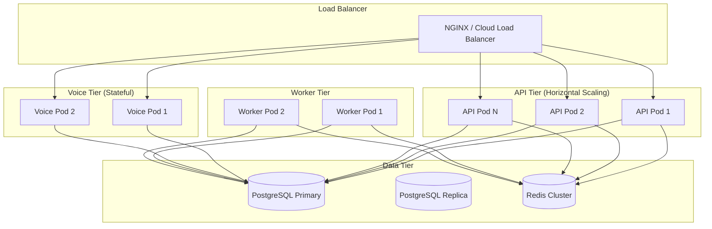

---

## 30. Future Phase: Conversation Evaluation Framework

> **Strategic Addition for GoodBox AI Alignment**
> 
> While not a Phase 0 blocker, this capability should be planned for Phase 10+ to differentiate AgentSphere as an enterprise-grade platform.

### 23.1 Evaluation Dimensions

| Dimension | Metric | Measurement |
|-----------|--------|-------------|
| **Task Completion** | Resolution Rate | % conversations resolved without escalation |
| **Factual Accuracy** | Hallucination Rate | LLM-as-judge + ground truth comparison |
| **Response Latency** | P50/P95/P99 | End-to-end + per-component breakdown |
| **Customer Satisfaction** | CSAT/NPS | Post-conversation surveys, sentiment analysis |
| **Tool Efficiency** | Unnecessary Tool Calls | Tool calls per resolution, failed tool rate |
| **Escalation Quality** | Escalation Rate + Context Preservation | % escalated, context completeness at handoff |

### 23.2 Architecture Reserved

```
src/agentsphere/application/evaluation/
├── __init__.py
├── evaluators/
│   ├── __init__.py
│   ├── task_completion.py
│   ├── factual_accuracy.py
│   ├── latency.py
│   ├── satisfaction.py
│   └── tool_efficiency.py
├── judges/
│   ├── __init__.py
│   ├── llm_judge.py
│   └── human_judge.py
├── aggregation.py
└── reporting.py
```

### 23.3 Integration Points

- **Event Bus**: Consumes `ConversationEnded` events for batch evaluation
- **Analytics API**: Exposes evaluation dashboards per tenant
- **A/B Testing**: Framework for comparing prompt/model configurations
- **Feedback Loop**: Evaluation results feed back into prompt optimization

---

## 31. Next Steps

This Architecture Plan provides the complete foundation for AgentSphere. The architecture is now **frozen v1.1** — all Phase 0.1 improvements applied. No further architectural restructuring unless explicitly requested.

The next step is to review and approve this plan, then proceed to **Phase 1: Core Platform Infrastructure** which will implement:

1. Project scaffolding (FastAPI, configuration, logging, CI/CD)
2. Database setup (PostgreSQL, pgvector, Alembic migrations)
3. Authentication & Authorization (JWT, RBAC, API Keys)
4. Tenant Management API
5. Health checks and observability foundation
6. Quality gates (Ruff, mypy, pytest, security scanning)

**Awaiting your approval to proceed to Phase 1 Implementation Plan.**

